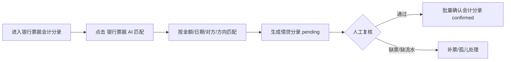
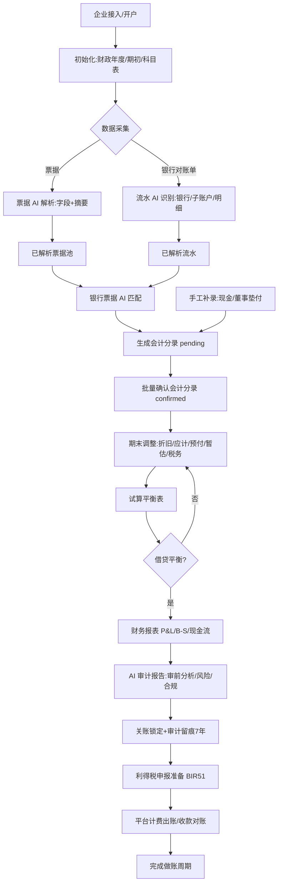

# EasybookX 全功能产品需求文档（PRD v1.0）

| 项 | 内容 |
|---|---|
| 产品 | EasybookX（Leapex 利柏思）· 香港中小企业财税 SaaS 平台 |
| 范围 | 覆盖**全部功能模块**：会计做账 + 平台管理 + AI 审计报告 + TCSP 公司秘书小程序 |
| 准则 | SME-FRS / HKFRS · HKSA · Cap.622 / Cap.112 / Cap.50 / PDPO · 币种 HKD |
| 技术栈 | FastAPI + SQLModel + SQLite · 原生 HTML/CSS/JS 单文件原型 · Nginx + systemd |
| 关联 | [[PRD_平台管理_v1.0]]、[[PRD_审计报告_v1.0]]、[[prompts_银行票据匹配会计分录]]、[[财务报告生成规则与说明]] |

---

## 一、产品背景与目标

### 1.1 市场背景与行业洞察

> 数据口径：以下为行业公开资料与通行估算（香港公司注册处年报、HKICPA、香港税务局、审计/记账自动化行业研究）。**联网核验暂不可用，正式发布前请复核最新数值。**

- **刚性市场**：香港《公司条例》(Cap.622) 要求几乎所有本地私人有限公司**每年法定审计**；香港**活跃本地公司约 140 万家**，叠加每年数十万新注册，记账—审计—报税需求刚性且持续。
- **TCSP 持牌化**：香港《打击洗钱条例》要求公司服务提供者 (TCSP) 持牌经营，公司秘书 / 注册 / KYC 业务规范化、线上化空间大。
- **AI 渗透加速**：全球会计与审计自动化市场处于 **20%–30% 年增长**区间；四大已普及 AI 分析性复核、OCR、异常检测；中小所 / 记账公司因**人力密集、利润薄、招聘难**，提效工具需求迫切。
- **传统模式痛点**：
  - **手工录入重**：票据、银行流水人工录入耗时易错。
  - **对账割裂**：流水与票据靠人工核对，匹配率低。
  - **关账周期长**：期末调整、试算平衡、出表依赖经验，易遗漏。
  - **审前准备苦**：审计前整理底稿、识别风险耗时数天。
  - **多客户难管**：事务所管理众多客户公司，权限、计费、用量难统一。
  - **合规节点多**：BR 续期、周年申报 NAR1、利得税 BIR51、MPF、账簿 7 年留存。

### 1.2 用户目标
- **效率提升**：票据/流水 AI 解析 + 自动匹配生成分录，减少 **80%+** 手工录入；关账与审前准备从「数天」到「数分钟」。
- **准确可靠**：AI 解析 + 借贷校验 + 异常检测（A1–A13），错误率显著下降；「算术系统做、AI 只解读」防幻觉。
- **闭环合规**：覆盖采集 → 分录 → 调整 → 试算 → 报表 → 审前分析 → 报税准备全链路；全程 HKD、香港准则；审计留痕 7 年。
- **可经营的 SaaS**：多租户 + 套餐 + Token 用量后付费 + 强对账收款，支撑事务所 / SME 规模化运营。
- **一体两端**：Web 后台（会计做账 + 平台管理）+ 微信小程序（TCSP 公司秘书），覆盖企业全生命周期。

---

## 二、功能定义和概述

### 2.1 功能模块清单

| 功能模块 | 功能点 | 优先级 | 核心价值 |
|---|---|---|---|
| **数据采集（票据）** | 拖拽/批量上传、待解析列表、一键 AI 解析 | P0 | 入口效率 |
| | OCR 字段提取（商户/号/日期/金额/币种/BR） | P0 | 免手工录入 |
| | AI 摘要（内容总结提取） | P1 | 快速辨别 |
| | 确认 / 删除 / 批量 / 编辑弹窗（左预览右详情） | P0 | 数据治理 |
| **数据采集（银行流水）** | 多银行对账单上传、AI 识别银行/账户/子账户 | P0 | 自动归集 |
| | 多子账户与交易明细解析 | P0 | 还原结单 |
| | 确认 / 删除 / 批量 / 编辑弹窗 | P0 | 数据治理 |
| **银行票据会计分录** | 三列对照（流水/票据池/分录） | P0 | 可视对账 |
| | 银行票据 AI 匹配 | P0 | 自动生成分录 |
| | 匹配/取消/补票/孤儿处理 | P0 | 完整性 |
| | 批量确认会计分录 | P0 | 关账提效 |
| **手工补录** | 现金/无票/董事垫付录入、Excel 导入 | P1 | 补全账目 |
| **期末调整** | 折旧/应计/预付/暂估/税务/其他 | P0 | 权责发生制 |
| | AI 调整建议、全部确认 | P1 | 提效 |
| **试算平衡表** | 按账期聚合借贷、平衡校验 | P0 | 关账门槛 |
| **财务报表** | 损益表 / 资产负债表 / 现金流量 | P0 | 经营成果 |
| | 关账锁定、导出 | P0 | 合规留痕 |
| **账簿浏览** | 法定账簿（总账/明细/日记/AR/AP/MPF/税务等） | P1 | 钻取追溯 |
| **科目表 COA** | 香港标准三级科目 CRUD | P0 | 记账基础 |
| **AI 审计报告** | 选企业/期间/类型/框架、就绪度校验 | P0 | 审前增值 |
| | 比率/分析性复核/风险/合规/调整建议 | P0 | 审计辅助 |
| | 历史报告、导出、计费、留痕 | P1 | 复用变现 |
| **平台管理·租户** | 租户 CRUD、详情、暂停、风险预警 | P0 | SaaS 运营 |
| **平台管理·员工** | RBAC、邀请、编辑、授权、停用、2FA | P0 | 权限安全 |
| **平台管理·套餐计费** | 套餐 CRUD、Token 计量规则 | P0 | 定价 |
| **平台管理·账单收款** | 出账、对账、线上/线下支付、认领核销 | P0 | 收款闭环 |
| **平台管理·用量监控** | Token/OCR/存储、按租户、钻取、导出 | P1 | 成本管控 |
| **平台管理·审计日志** | 不可篡改留痕、筛选、导出 | P0 | 合规 |
| **账号与安全** | 登录/2FA/找回、设备管理、个人资料 | P0 | 账户安全 |
| **接入点管理** | MCP / API / 外部模型接入 | P2 | 扩展 |
| **TCSP 公司秘书（小程序）** | 首页/服务目录/KYC/核名/NNC1 注册 | P0 | 公司开办 |
| | 订单/账单/支付/交付物中心/我的公司/消息 | P0 | 秘书服务 |

### 2.2 功能模型图

```mermaid
graph TD
  EBX[EasybookX 平台]

  EBX --> WEB[Part A · 会计做账 Web]
  EBX --> PLAT[平台管理 超管]
  EBX --> AUD[AI 审计报告]
  EBX --> TCSP[Part B · TCSP 公司秘书 小程序]
  EBX --> ACC[账号与安全]

  WEB --> W1[票据采集与AI解析]
  WEB --> W2[银行流水采集]
  WEB --> W3[银行票据会计分录/AI匹配]
  WEB --> W4[手工补录]
  WEB --> W5[期末调整]
  WEB --> W6[试算平衡表]
  WEB --> W7[财务报表]
  WEB --> W8[账簿浏览]
  WEB --> W9[科目表 COA]

  PLAT --> P1[租户管理]
  PLAT --> P2[员工管理 RBAC]
  PLAT --> P3[套餐与计费]
  PLAT --> P4[账单与收款]
  PLAT --> P5[用量监控]
  PLAT --> P6[审计日志]

  AUD --> A1[配置:企业/期间/类型/框架]
  AUD --> A2[数据就绪度校验]
  AUD --> A3[AI六阶段流水线]
  AUD --> A4[报告预览/导出/历史]

  TCSP --> T1[服务目录]
  TCSP --> T2[KYC/核名/NNC1注册]
  TCSP --> T3[订单/账单/支付]
  TCSP --> T4[交付物中心/我的公司/消息]

  ACC --> C1[登录/2FA/找回]
  ACC --> C2[设备管理/个人资料]
```

---

## 三、用户角色和使用场景

### 3.1 用户角色说明
| 角色 | 说明 | 主要诉求 |
|---|---|---|
| **记账员 bookkeeper** | 日常录票、对账、录入分录 | 高效采集与匹配，少出错 |
| **主管会计 senior** | 科目维护、确认分录、关账 | 准确关账、出表 |
| **审核员 reviewer** | 复核确认、关账 | 风险可视、可追溯 |
| **租户管理员 tenant_admin** | 管理本所员工/公司/套餐/账单 | 权限、计费、用量统一管理 |
| **平台超级管理员** | 运营方，跨租户管理 | 经营看板、收款、合规留痕 |
| **SME 老板 / 管理者** | 看经营、审前自查 | 通俗报告、合规清单 |
| **CPA 事务所审计** | 审前分析、底稿 | 自动化分析性复核与风险识别 |
| **创业者（TCSP 客户）** | 开公司、做秘书 | 在线 KYC/核名/注册/交付 |

### 3.2 核心使用场景

#### 场景一：票据/流水采集 → AI 解析
- **痛点**：手工录入大量票据与银行流水，耗时且易错。
- **用户故事**：作为记账员，我希望上传票据/对账单后系统自动 OCR 提取字段与摘要，以便免去手工录入。

#### 场景二：银行票据 AI 匹配生成分录
- **痛点**：流水与票据人工核对慢、匹配率低、易漏。
- **用户故事**：作为记账员，我希望一键 AI 匹配银行流水与票据并自动生成会计分录，以便快速完成对账。

#### 场景三：期末关账出表
- **痛点**：期末调整、试算平衡、出表依赖经验，易遗漏不平衡。
- **用户故事**：作为主管会计，我希望按规则完成期末调整并自动生成试算平衡与财务报表，以便准时关账。

#### 场景四：AI 审计报告（审前分析）
- **痛点**：审计前整理底稿、识别风险耗时数天。
- **用户故事**：作为 CPA 审计，我希望选定客户一键生成审前分析报告，以便缩短现场审计时间。

#### 场景五：平台运营（多租户管理与收款）
- **痛点**：管理众多客户公司，权限、计费、用量、收款难统一。
- **用户故事**：作为平台超管，我希望统一管理租户/员工/套餐/账单/用量，以便高效经营 SaaS。

#### 场景六：TCSP 在线开公司
- **痛点**：开公司流程繁琐、线下跑动、进度不透明。
- **用户故事**：作为创业者，我希望在小程序完成 KYC、核名、NNC1 注册并跟踪交付，以便快速开办公司。

---

## 四、核心业务流程

---

## 五、功能详细说明（页面级）

> 说明：以下按页面列出关键内容、字段规则与异常提示；通用规则——金额借贷必相等、仅 `confirmed` 分录入账、币种 HKD、香港不征 GST/VAT。

### 5.1 票据上传 & AI 解析（page-inv）
- **上传区**：拖拽/点击；支持 JPG/PNG/PDF；可多选；进入「待解析列表」。
- **待解析列表**：文件名、所属公司、相关方、类型、上传状态（成功/失败）、归属、上传时间；操作（迁移/删除）；「一键解析」批量提交 OCR。
- **已解析票据列表**字段：
  - 复选框（批量用）
  - 商户 / 发票号
  - 日期
  - 金额（必填，含币种前缀）
  - **币种**（HKD/USD/CNY/EUR/GBP，AI 提取，可改）
  - **商业登记号 BR No**（供应商 8 位，AI 提取，可改；香港开支实证/AMLO 尽调关键）
  - 费用类别（COA 友好枚举）
  - **摘要 (AI)**（对票据内容的总结提取，截断显示+悬浮全文，可编辑/重新生成）
  - 类型（收入/支出）
  - 解析状态（✓ 解析成功 / ✗ 解析失败；置信度 <60 视为失败）
  - 操作：编辑 / 确认 / 删除
- **顶部右侧**：批量确认、批量删除。
- **编辑弹窗（左预览 + 右可编辑）**：
  - 左：票据原件预览（商户/发票号/日期/BR/类别/金额/AI 摘要/置信度）
  - 右：可编辑 商户、发票号、日期、金额、币种、BR No、费用类别、票据类型、**摘要**（可「按当前字段重新生成」）；保存后视为「解析成功」。
- **异常提示**：「金额未填，请填写」「该票据解析失败，请编辑补全」「确认删除该票据？不可恢复」。

### 5.2 银行流水上传（page-bank）
- **上传区**：支持 PDF/XLS/XLSX；多选进入「待解析列表」；AI 自动识别银行（HSBC/恒生/中银等）。
- **待解析列表**：文件名、所属公司、文件页数、归属、上传时间；清空 / 一键解析。
- **已上传对账单列表**字段：复选框、文件名、所属银行、账号、账户类型、月份、笔数、期末余额、状态（已解析/已确认）、操作。
- **顶部右侧**：批量确认、批量删除；日期区间筛选。
- **行操作**：预览、编辑、确认、删除。
- **编辑弹窗（左预览 + 右可编辑详情，对齐预览弹窗）**：
  - 左：对账单文件预览（银行/账号/账期/期末余额 + 交易明细预览）
  - 右：可编辑 对账单名称、所属银行（含全称）、账户类型、我方户号、**分行 Branch**、**账期起始/结束**、**页数**、账期月份、交易笔数、期末余额、**关系总结余**、**备注/AI 说明**、AI 置信度（只读）；保存同步回明细并使「预览」一致。
- **预览弹窗**：statement 级表头 + 多子账户区块（承前结转/逐笔/小计）+ 备注。
- **异常提示**：「账号未填」「确认删除对账单？不可恢复」「请先勾选要批量操作的对账单」。

### 5.3 银行票据会计分录（page-recon）
- **总览**：已处理/待处理/总流水/总票据/待补票。
- **筛选**：账期区间、状态（全部/待处理/已处理）。
- **操作栏**：**银行票据 AI 匹配**、**批量确认会计分录**、导出银行流水、导出票据。
- **三列对照**：银行流水 | 票据池 | 会计分录（Dr/Cr 行 + 状态 pending/confirmed）。
- **匹配交互**：拖拽/点击匹配、取消匹配（退回孤儿）、孤儿费用标注董事垫付、孤儿收入挂应收。
- **AI 匹配**：按金额/日期/对方/方向自动匹配 pending 对，给出结果与未解决项（缺票/缺流水）。
- **批量确认**：将 pending 分录批量置 confirmed，计入试算平衡。
- **异常提示**：「当前没有待确认的会计分录」「仍有 N 笔需人工处理」。

### 5.4 手工补录会计分录（page-cash）
- 手工补录（现金/无票/董事垫付）；下载 Excel 模板、批量导入；列表按类别筛选、导出。

### 5.5 期末调整（page-adjust）
- 类别 chip：折旧/应计/预付/暂估/税务/其他。
- 录入：借方科目、贷方科目、金额、说明；状态 pending。
- 操作：确认、全部确认、删除；AI 调整建议回填。
- 规则与香港要点见 [[财务报告生成规则与说明]] §一。

### 5.6 试算平衡表（page-tb）
- 按账期聚合**已确认**分录与调整的借贷；展示每科目 dr/cr + 合计；平衡判定 `|dr−cr|<0.01`。
- 平衡通过 → 「确认并生成财务报表」。
- 异常：不平衡禁止出表，提示排查。

### 5.7 财务报表（page-reports）
- 损益表（I/X 推导）、资产负债表（A/L/E 推导 + 平衡校验）、现金流量（可选）。
- 关账（写 SYSTEM_PERIOD_LOCKED）、导出。规则见 [[财务报告生成规则与说明]] §三。

### 5.8 账簿浏览（page-ledger）
- 法定账簿列表（总账/明细分类账/日记账/AR/AP/固定资产/MPF/税务等）；钻取至原始凭证。

### 5.9 科目表 COA（page-coa）
- 香港标准三级科目；字段 code/中英文/级别/父级/类别(A/L/E/I/X)/正常余额/可记账/启用；CRUD + 折叠展开。

### 5.10 AI 审计报告（page-auditrpt）
- 配置（企业/FY/报告类型/框架/深度模式）+ 数据就绪度校验 + 六阶段进度 + 分章报告（免责声明/摘要/比率/风险/合规/调整建议/附注/管理建议）+ 历史/导出/计费/留痕。详见 [[PRD_审计报告_v1.0]]。

### 5.11 平台管理（page-tenants/users/plans/billing/usage/audit）
- 租户：统计卡 + 列表（搜索/状态筛选）+ 详情抽屉 + 编辑 + 暂停/恢复 + 风险预警。
- 员工：RBAC 五角色、邀请、编辑（角色/公司授权/2FA）、停用/恢复、重置密码、导出。
- 套餐：数据化卡片 + 新建/编辑 + 查看套餐租户 + Token 单价可编辑。
- 账单：看板 + 列表（状态机 draft→issued→proof_uploaded→paid/overdue）+ 月初批量出账 + 认领核销 + 收款账户。
- 用量：时间切换、按租户明细、钻取、导出。
- 审计日志：分类/用户/日期筛选、加载更多、详情、导出 CSV。
- 详见 [[PRD_平台管理_v1.0]]。

### 5.12 账号与安全（page-me + 登录）
- 登录/找回/激活；2FA 启用；登录设备列表与退出；个人资料；最近活动；修改密码（强度校验）。

### 5.13 TCSP 公司秘书（小程序）
- 底部 Tab：首页 / 服务 / 订单 / 我的。
- 服务目录 → 详情 → 下单/表单 → 账单 → 支付成功；KYC 5 步、公司核名、NNC1 注册；订单/订单详情、交付物中心、凭证、我的公司、消息。

---

## 六、异常处理

| 场景 | 处理策略 | 提示 |
|---|---|---|
| 票据/流水必填缺失 | 阻断保存 | xxx 未填，请填写 |
| 解析失败（置信度低） | 标红，引导编辑补全 | 解析失败，请人工编辑 |
| 删除确认 | 二次确认，不可恢复 | 确认删除？不可恢复 |
| 批量操作未勾选 | 阻断 | 请先勾选记录 |
| AI 匹配缺票/缺流水 | 进 unmatched/orphan，给建议 | 仍有 N 笔需人工处理 |
| 分录借贷不等 | 拦截确认 | 借贷不平，无法确认 |
| 待确认调整未确认 | 阻断出表 | 请先确认全部期末调整 |
| 试算不平衡 | 禁止出表 | 借贷差额 HKD X，请平账 |
| B/S 不平衡 | 禁止关账 | 资产≠负债+权益，请核对 |
| 审计报告数据未就绪 | 警示可强制 | 数据不完整，仍要生成？ |
| 越权操作 | 按 RBAC 隐藏/禁用 | 当前角色无权限 |
| Token 配额不足 | 阻断 AI 功能 | 配额不足，请升级套餐 |
| 后端不可达 | 回退本地缓存（演示） | 网络异常，已用本地缓存 |
| 个人资料导出 | 二次确认（PDPO） | 含个人资料，确认导出？ |

---

## 七、数据埋点方案

| 触发时机 | 业务意义 |
|---|---|
| 上传票据 / 银行对账单 | 采集活跃度与入口转化 |
| 点击一键解析 | OCR 调用量 / 成本 |
| 票据解析成功 / 失败 | 解析准确率监控 |
| 编辑/确认/删除票据或流水 | 数据治理行为分析 |
| 点击「银行票据 AI 匹配」 | 匹配功能使用率 |
| AI 匹配完成（匹配率） | 匹配效果评估 |
| 批量确认会计分录 | 关账提效度量 |
| 新增/确认期末调整 | 权责调整规范度 |
| 生成试算平衡 / 不平衡 | 关账质量 / 错误定位 |
| 生成财务报表 / 关账 | 关账完成率 |
| 生成 AI 审计报告 | 增值功能转化 / 计费 |
| 审计报告各阶段耗时/失败 | 流水线性能 |
| 调整建议「回填期末调整」 | 闭环转化 |
| 导出报表/报告/CSV | 交付转化 |
| 租户 创建/暂停/编辑 | SaaS 经营动作 |
| 员工 邀请/停用/角色变更 | 权限与安全审计 |
| 账单 出账/支付/核销 | 收款健康度 / MRR |
| 用量 钻取/导出 | 成本管控 |
| TCSP 下单/支付/交付领取 | 公司秘书业务转化 |
| 登录/2FA 启用/异地登录 | 账户安全 |

> 统一上报字段建议：`user_id / tenant_id / company_id / module / action / result / duration_ms`，支持按租户、模块、角色多维分析。

---

## 八、非功能性与合规
- **多租户隔离**：所有查询隐含 `tenant_id`，超管显式跨租户。
- **审计留痕**：敏感操作 append-only，7 年留存（Cap.622 / IRO S.51C / PDPO）。
- **数据安全**：发送模型前脱敏（身份证/银行全账号/个人电话）。
- **合规边界**：平台出具账目与管理/审前报告，**不替代 HKICPA 法定审计意见**。
- **币种/税务**：统一 HKD，香港不征 GST/VAT；利得税两级 8.25%/16.5%。
- **i18n**：简体 / 繁體 / English。
