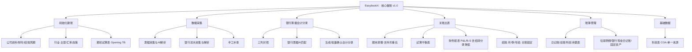
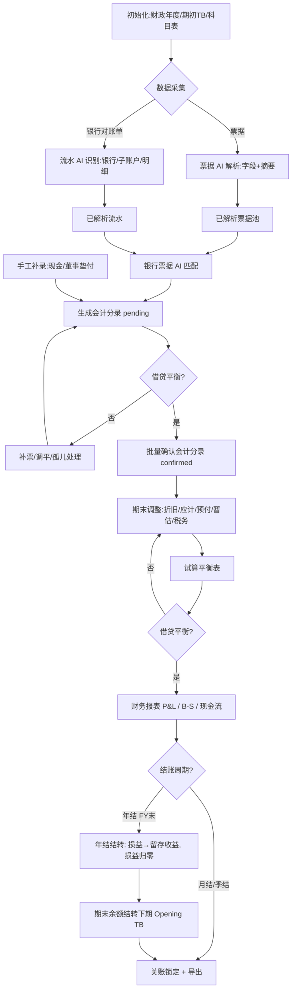

# EasybookX 产品需求文档（PRD v1.0 · 核心做账闭环）

| 项 | 内容 |
|---|---|
| 产品 | EasybookX · 香港中小企业财税 SaaS 平台 |
| 版本 | **v1.0**：核心会计做账闭环（采集 → 对账分录 → 期末调整 → 试算 → 报表）|
| 范围 | 数据采集（票据）、数据采集（银行流水）、银行票据会计分录、手工补录、期末调整、试算平衡表、财务报表、科目表 COA |
| 准则 | SME-FRS / HKFRS · Cap.622 / Cap.112 · 币种 HKD · 香港不征 GST/VAT |
| 技术栈 | FastAPI + SQLModel + SQLite · 原生 HTML/CSS/JS 单文件原型 |
| 关联 | [[prompts_银行票据匹配会计分录]]、[[财务报告生成规则与说明]]；增值与运营能力见 [[EasybookX_产品需求文档_PRD_v1.1]] |

---

## 一、产品背景与目标

### 1.1 市场背景与行业洞察

> 数据口径：行业公开资料与通行估算（香港公司注册处年报、HKICPA、香港税务局、记账/审计自动化行业研究）。**联网核验暂不可用，正式发布前请复核最新数值。**

- **刚性市场**：香港《公司条例》(Cap.622) 要求几乎所有本地私人有限公司**每年法定审计**；香港**活跃本地公司约 140 万家**，叠加每年数十万新注册，记账—关账—报税需求刚性且持续。
- **AI 渗透加速**：全球会计自动化市场处于 **20%–30% 年增长**区间；OCR、智能对账、异常检测已成主流；中小所 / 记账公司**人力密集、利润薄、招聘难**，提效工具需求迫切。
- **传统做账痛点**：
  - **手工录入重**：票据、银行流水人工录入耗时易错。
  - **对账割裂**：流水与票据靠人工核对，匹配率低、易遗漏。
  - **关账周期长**：期末调整、试算平衡、出表依赖经验，借贷不平难定位。
  - **科目不规范**：缺乏香港标准 COA，分类口径不统一。

### 1.2 用户目标
- **效率提升**：票据/流水 AI 解析 + 自动匹配生成分录，减少 **80%+** 手工录入；关账从「数天」到「数小时」。
- **准确可靠**：AI 解析 + **借贷平衡强校验**，「算术系统做、AI 只解读」，错误率显著下降。
- **闭环可审计**：覆盖 采集 → 对账分录 → 期末调整 → 试算平衡 → 财务报表 全链路；全程 HKD、香港准则；状态可追踪。
- **标准合规**：内置香港标准三级 COA 与 SME-FRS 口径，开支凭证（BR No）可追溯。

---

## 二、功能定义和概述

### 2.1 功能模块清单

| 功能模块 | 功能点 | 优先级 | 核心价值 |
|---|---|---|---|
| **初始化建账** | 公司资料、财政年度（首年 ≤18 月）、本位币、**结账周期**（月/季/年）| P0 | 建账基础 |
| | **所属行业（香港标准行业分类码 HSIC v2.0）+ 主营业务说明** | P0 | 与利得税 BIR51/iXBRL 报税一致 + AI 记账上下文 |
| | **汇率政策**（取价：平均/月初/即期手工；汇率来源；期末重估开关+科目）| P1 | 外币核算基础 |
| | 期初试算表（Opening TB）导入 + 借贷平衡校验 | P0 | 期初连续勾稽 |
| **数据采集（票据）** | 拖拽/批量上传、待解析列表、一键 AI 解析 | P0 | 入口效率 |
| | OCR 字段提取（商户/号/日期/金额/币种/BR）| P0 | 免手工录入 |
| | AI 摘要（内容总结提取）| P1 | 快速辨别 |
| | 确认 / 删除 / 批量 / 编辑弹窗（左预览右详情）| P0 | 数据治理 |
| **数据采集（银行流水）** | 多银行对账单上传、AI 识别银行/账户/子账户 | P0 | 自动归集 |
| | 多子账户与交易明细解析 | P0 | 还原结单 |
| | 确认 / 删除 / 批量 / 编辑弹窗 | P0 | 数据治理 |
| **银行票据会计分录** | 三列对照（流水/票据池/分录）| P0 | 可视对账 |
| | 银行票据 AI 匹配（含差额/容差判定）| P0 | 自动生成分录 |
| | 匹配/取消/补票/孤儿处理 | P0 | 完整性 |
| | 批量确认会计分录 | P0 | 关账提效 |
| **手工补录** | 现金/无票/董事垫付录入；已完成/待完善状态 | P1 | 补全账目 |
| **期末调整** | 折旧/应计/预付/暂估/税务/**外币重估**/其他 | P0 | 权责发生制 |
| | AI 调整建议、全部确认 | P1 | 提效 |
| **外币与汇率核算** | 交易按月平均入账、期末货币性项目重估（6604 汇兑损失）、列报折算（3102 折算储备）| P1 | 外币合规 |
| **试算平衡表** | 按账期聚合借贷、平衡校验（= 期初 TB + 本期发生额）| P0 | 关账门槛 |
| **财务报表** | 损益表 / 资产负债表 / 现金流量（可选）+ **外币折算** | P0 | 经营成果 |
| | **出表前完整性校验（可收起）** + 各报表逐行取数公式 | P0 | 出表质量 |
| | **结转分录**（财务报表内**只读弹窗**·依结账周期自动生成、无需确认）| P0 | 关账透明 |
| | 导出 Excel / PDF | P0 | 交付 |
| **结账（月/季/年结）** | 月/季结仅锁期出表；**年结**结转损益→留存收益、损益归零 | P0 | 跨期正确 |
| | 期末余额结转下期期初 TB、关账锁定（确认财务报表）、反结账 | P0 | 连续勾稽/合规 |
| **账簿管理** | 日记账（序时账）/ 总账 / 科目余额表 / 往来明细账（AR·AP）/ 银行·现金日记账 / 固定资产登记簿 | P0 | 法定账簿（Cap.622 S.373）|
| **科目表 COA** | 香港标准三级科目 CRUD；**科目主数据单一来源**（账簿/报表只读引用）；**备抵科目**（cat=A 但 nb=Cr，如累计折旧/坏账准备）| P0 | 记账基础 |

### 2.2 功能模型图

---

## 三、用户角色和使用场景

### 3.1 用户角色说明
| 角色 | 说明 | 主要诉求 |
|---|---|---|
| **记账员 bookkeeper** | 日常录票、对账、录入分录 | 高效采集与匹配，少出错 |
| **主管会计 senior** | 科目维护、确认分录、关账出表 | 准确关账、报表可靠 |
| **审核员 reviewer** | 复核确认、关账 | 风险可视、可追溯 |

### 3.2 核心使用场景

#### 场景一：票据/流水采集 → AI 解析
- **痛点**：手工录入大量票据与银行流水，耗时且易错。
- **用户故事**：作为记账员，我希望上传票据/对账单后系统自动 OCR 提取字段与摘要，以便免去手工录入。

#### 场景二：银行票据 AI 匹配生成分录
- **痛点**：流水与票据人工核对慢、匹配率低、易漏。
- **用户故事**：作为记账员，我希望一键 AI 匹配银行流水与票据并自动生成会计分录，以便快速完成对账。

#### 场景三：期末关账出表
- **痛点**：期末调整、试算平衡、出表依赖经验，易遗漏不平衡。
- **用户故事**：作为主管会计，我希望按规则完成期末调整并自动生成试算平衡与财务报表，以便准时关账。

---

## 四、核心业务流程

---

## 五、功能详细说明（页面级 · 含状态说明）

> 通用规则——金额借贷必相等、仅 `confirmed` 分录入账、币种 HKD、香港不征 GST/VAT。
>
> **状态贯通主线**：票据/流水 `解析(staged→parsing→success/failed/edited)` → 对账 `配对(match/partial/pending/unmatched/orphan/annotated)` → 分录 `(pending→confirmed，借贷平衡为前提；ignored/reversed)` → 试算 `(balanced/unbalanced)` → 报表 `(draft/generated)` → **结账 `(not_closed/month_closed/year_closed，年结结转损益→留存收益)`** → 账期 `(open/locked)` → 期末余额结转下期 Opening TB。

### 5.1 数据采集（票据）· 票据上传 & AI 解析（page-inv）
- **上传区**：拖拽/点击；支持 JPG/PNG/PDF；可多选；进入「待解析列表」。
- **待解析列表**：文件名、所属公司、相关方、类型、上传状态（成功/失败）、归属、上传时间；操作（迁移/删除）；「一键解析」批量提交 OCR。
- **已解析票据列表**字段：复选框；商户 / 发票号；日期；金额（必填，含币种前缀）；**币种**（HKD/USD/CNY/EUR/GBP，AI 提取可改）；**商业登记号 BR No**（供应商 8 位，AI 提取可改；香港开支实证/AMLO 尽调关键）；费用类别（COA 友好枚举）；**摘要 (AI)**（截断显示+悬浮全文，可编辑/重新生成）；类型（收入/支出）；解析状态；操作（编辑/确认/删除）。
- **顶部右侧**：批量确认、批量删除。
- **编辑弹窗（左预览 + 右可编辑）**：左=票据原件预览（商户/发票号/日期/BR/类别/金额/AI 摘要/置信度）；右=可编辑 商户、发票号、日期、金额、币种、BR No、费用类别、票据类型、**摘要**（可「按当前字段重新生成」）；保存后视为「解析成功」。
- **异常提示**：「金额未填，请填写」「该票据解析失败，请编辑补全」「确认删除该票据？不可恢复」。
- **状态说明**：

  | 维度 | 状态值 | 含义 / 判定规则 |
  |---|---|---|
  | 解析状态 parse_status | `staged` 待解析 | 已上传进入待解析列表，尚未提交 AI |
  | | `parsing` 解析中 | AI OCR 识别进行中 |
  | | `success` 解析成功 | AI 置信度 ≥ 60% 且关键字段（金额/日期）齐全 |
  | | `failed` 解析失败 | 置信度 < 60% / 手写模糊 / 无法识别 / 关键字段缺失 |
  | | `edited` 已修正 | 人工编辑补全后，视为解析成功 |
  | 确认状态 | `unconfirmed` 待确认 / `confirmed` 已确认 | 「确认」后纳入对账与后续记账 |
  | 数据质量 | `own` 本公司 / `non_own` 非本公司 | 非本公司不可批量解析，需迁移或切换账套 |
  | | `duplicate` 疑似重复 | 同发票号/同商户金额日期重复，提示去重 |
  | 对账状态 recon_state | `unmatched` / `matched` / `pending` / `orphan` | 与 5.3 联动 |

### 5.2 数据采集（银行流水）· 银行流水上传（page-bank）
- **上传区**：支持 PDF/XLS/XLSX；多选进入「待解析列表」；AI 自动识别银行（HSBC/恒生/中银等）。
- **待解析列表**：文件名、所属公司、文件页数、归属、上传时间；清空 / 一键解析。
- **已上传对账单列表**字段：复选框、文件名、所属银行、账号、账户类型、月份、笔数、期末余额、状态（已解析/已确认）、操作。
- **顶部右侧**：批量确认、批量删除；日期区间筛选。**行操作**：预览、编辑、确认、删除。
- **编辑弹窗（左预览 + 右可编辑详情，对齐预览弹窗）**：左=对账单文件预览（银行/账号/账期/期末余额 + 交易明细预览）；右=可编辑 对账单名称、所属银行（含全称）、账户类型、我方户号、**分行 Branch**、**账期起始/结束**、**页数**、账期月份、交易笔数、期末余额、**关系总结余**、**备注/AI 说明**、AI 置信度（只读）；保存同步回明细并使「预览」一致。
- **预览弹窗**：statement 级表头 + 多子账户区块（承前结转/逐笔/小计）+ 备注。
- **异常提示**：「账号未填」「确认删除对账单？不可恢复」「请先勾选要批量操作的对账单」。
- **状态说明**：

  | 维度 | 状态值 | 含义 / 判定规则 |
  |---|---|---|
  | 解析状态 parse_status | `staged` 待解析 | 已上传待解析 |
  | | `parsing` 解析中 | 读取格式→识别银行→提取交易→完整性校验 |
  | | `success` 解析成功 | 银行/账号/账期/笔数/期末余额识别完成并导入流水 |
  | | `failed` 解析失败 | 格式错误 / 银行账号识别失败（可人工编辑补救）|
  | | `non_own` 非本公司 | 抬头非当前账套，需一键迁移后再解析 |
  | 完整性 | `page_complete` 页数完整 / `incomplete` 缺页 | 缺页提示补齐，不建议直接提交 |
  | 确认状态 | `parsed` 已解析 / `confirmed` 已确认 | 「确认」后锁定该对账单用于对账 |
  | 交易级 match_status | `unmatched` 未匹配 / `matched` 已匹配 | 单笔流水是否已与票据/分录关联（见 5.3）|

### 5.3 银行票据会计分录（page-recon）
- **总览**：已处理/待处理/总流水/总票据/待补票。**筛选**：账期区间、状态（全部/待处理/已处理）。
- **操作栏**：**银行票据 AI 匹配**、**批量确认会计分录**、导出银行流水、导出票据。
- **三列对照**：银行流水 | 票据池 | 会计分录（Dr/Cr 行 + 状态）。
- **匹配交互**：点击展开详情可二次修改；取消匹配（退回孤儿）；孤儿费用标注董事垫付、孤儿收入挂应收。
- **AI 匹配**：按金额/日期/对方/方向自动匹配，给出结果与未解决项（缺票/缺流水）。**批量确认**：将 pending 分录批量置 confirmed，计入试算平衡。
- **异常提示**：「当前没有待确认的会计分录」「仍有 N 笔需人工处理」「借贷不平，无法确认」。
- **状态说明（核心，含两套状态机）**：

  **① 对账配对状态 ReconPair.status**（银行流水 ↔ 票据 的关联结果）

  | 状态值 | 含义 | 判定规则 |
  |---|---|---|
  | `match` 已匹配 | 流水与票据金额闭合、方向一致，并据此生成**借贷平衡**的分录 | 金额相等（或差额在容差内）+ 生成的 JE 借贷平衡 |
  | `partial` 部分匹配 | 已关联但金额存在差额（如银行手续费、部分收款）| 0 < 绝对值(流水金额 − 票据合计) ≤ 容差/人工判断 |
  | `pending` 待确认 | AI 建议匹配待人工确认；或暂未调平、等待补充 | AI 给出候选但未人工确认 |
  | `unmatched` 未匹配 | 有流水无票据（待补票）/ 有票据无流水（待补发票）/ **借贷无法平衡** | 找不到对应项，或借贷不平无法成分录 |
  | `orphan` 孤票/孤流水 | 仅有票据而无对应银行流水（现金、董事垫付、已开票未收款）| 无可匹配的流水 |
  | `annotated` 已标注 | 孤票已标注付款方式（董事垫付/挂应收等），可据此生成分录 | 用户对 orphan 完成付款方式标注 |

  **② 会计分录状态 JournalEntry.status**

  | 状态值 | 含义 | 判定规则 |
  |---|---|---|
  | `pending` 待确认 | 分录已生成，待人工审核 | AI 生成 / 手工补录 / 期末调整初始态 |
  | `confirmed` 已确认 | **借贷平衡（Dr=Cr）且人工确认**，计入试算平衡与报表 | `Σ Dr = Σ Cr` 且点击确认 |
  | `ignored` 已忽略 | 不计入 TB 与报表（可恢复为 pending）| 用户忽略 |
  | `reversed` 已冲销 | 对已确认分录做红冲 | 用户冲销 |

  > **关键判定（技术开发重点）**：AI 匹配生成分录后——
  > - **借贷平衡（Dr 合计 = Cr 合计）** → 配对置 `match`（已匹配），分录可「确认」为 `confirmed`；
  > - **借贷不平衡** → **拦截保存/确认**，配对保持 `unmatched/pending`（未匹配/待确认），提示差额，直至调平；
  > - 仅 `confirmed` 分录进入试算平衡与财务报表。

### 5.4 手工补录会计分录（page-cash）
- 手工补录（现金/无票/董事垫付）；下载 Excel 模板、批量导入；列表按类别筛选、导出。用于**无银行流水或无票据**场景（现金、备用金、董事垫付、银行利息等）。
- **状态说明**：

  | 维度 | 状态值 | 含义 / 判定规则 |
  |---|---|---|
  | 对账状态 recon_st | `orphan` 待确认 | 已录入但对应分录尚未确认 |
  | | `matched` 已入账 | 对应分录已确认 |
  | 分录状态 | `pending` 待确认 → `confirmed` 已确认 | 借贷平衡且确认后计入 TB |
  | 导入状态 | `imported` 成功 / `error` 失败（行级报错）| Excel 批量导入逐行校验，金额≤0/缺字段则该行 error |

### 5.5 期末调整（page-adjust）
- 类别 chip：折旧/应计/预付/暂估/税务/其他。录入：借方科目、贷方科目、金额、说明；状态 pending。
- 操作：确认、全部确认、删除；AI 调整建议回填。规则与香港要点见 [[财务报告生成规则与说明]] §一。
- **状态说明**：

  | 维度 | 状态值 | 含义 / 判定规则 |
  |---|---|---|
  | 调整分录 AdjEntry.status | `pending` 待确认 | 系统 AI 建议或人工新增，未确认 |
  | | `confirmed` 已确认 | 借贷平衡且确认后计入 **Adjusted Trial Balance** |
  | 来源 | `ai_suggested` AI 建议 / `manual` 人工新增 | AI 建议可一键回填后再确认 |
  | 校验 | 借贷不平衡 → 不可确认；存在 `pending` 调整 → TB 仅可预览并提示「未调整完成」 | |

### 5.6 试算平衡表（page-tb）
- 按账期聚合**已确认**分录与调整的借贷；展示每科目 dr/cr + 合计；平衡判定 `绝对值(dr−cr)<0.01`。平衡通过 →「确认并生成财务报表」。异常：不平衡禁止出表，提示排查。
- **状态说明**：

  | 维度 | 状态值 | 含义 / 判定规则 |
  |---|---|---|
  | 平衡状态 | `balanced` 已平衡 | `绝对值(Dr合计 − Cr合计) < 0.01` |
  | | `unbalanced` 不平衡 | 差额 ≥ 0.01，展示差额，**禁止生成正式财报** |
  | 口径 | `unadjusted` 未调整 / `adjusted` 已调整 | 是否含已确认期末调整 |
  | 数据完整度 | `draft` 草稿（存在未确认分录/调整）/ `final` 可出表 | 仅当待处理项清零且平衡时为 final |

### 5.7 财务报表（page-reports）
- 损益表（I/X 推导，**逐行取数公式**）、资产负债表（A/L/E 推导 + 平衡校验）、现金流量（可选）；**外币折算**（B/S 期末汇率、P&L 平均价、折算差额入 3102）。
- **报表期间随结账周期**（月/季/年）：月/季结损益不清零、权益按「股本 + 期初留存 + 本财年累计净利（未结转）」列示；年结后本期净利并入留存。
- **结转分录入口**：财务报表页「**结转分录**」按钮 → **只读弹窗**，依初始化结账周期**自动生成**结转分录预览（月/季结仅锁账、年结结转损益+留存滚存+期初结转），**无需用户二次确认**。
- **出表前完整性校验（可收起）**：期初余额/银行调节/完整性/试算平衡/**外币期末重估**/本期净利结转/资产=负债+权益/利得税两级/科目主数据一致性，逐项通过方为「可正式出表」。
- 关账：「**确认财务报表**」→ 账期 `locked`、写 `SYSTEM_PERIOD_LOCKED`；导出 Excel/PDF。规则与逐行公式见 [[财务报告生成规则与说明]] §六。
- **状态说明**：

  | 维度 | 状态值 | 含义 / 判定规则 |
  |---|---|---|
  | 报表状态 | `draft` 草稿 | TB 未平衡或存在未确认分录，仅可预览/标记草稿 |
  | | `generated` 已生成 | TB 平衡，P&L 与 B/S 生成；B/S 须满足 资产=负债+权益 |
  | 账期状态 | `open` 未关账 | 可继续记账修改 |
  | | `locked` 已关账 | 关账后锁定，修改须走反结账/调整分录流程 |

### 5.8 结转 / 结账（月 / 季 / 年结）· 入口：财务报表页
- **入口（已调整）**：结转 / 结账不再是独立左侧菜单；**结转分录**经财务报表页「结转分录」**只读弹窗**查看（自动生成、依结账周期、无需确认）；**关账锁定**由「确认财务报表」完成、超管可反结账。
- **前置**：财务报表已生成、TB 平衡、B/S 平衡、无 pending 分录/调整。
- **结账周期**（读 `closing_frequency`）：
  - **月结 / 季结**：仅**锁期 + 出表**，损益类**不清零**（财政年度内继续累计）。
  - **年结（FY 末）**：执行**结转分录**——
    - ① Dr 各收入(I) / Cr 本年利润；② Dr 本年利润 / Cr 各费用(X)；③ Dr 本年利润(净利) / Cr 留存收益(E)（亏损反向）。
    - 结转后**损益类(I/X)归零**，本期净利转入 **Retained Earnings**（= 期初留存 + 本期净利 − 分红）。
- **期末余额结转**：年结后生成**下一财政年度期初试算表 (Opening TB)** 预览（资产/负债/权益含更新后留存收益结转，损益期初为 0）。
- **关账锁定**：确认后账期 `locked`，写审计日志 `SYSTEM_PERIOD_LOCKED`。
- **反结账 (Reopen)**：红冲结转分录 + 解锁账期 → 调整后重新结账（全程留痕）。
- **页面内容**：结账周期选择、结转分录预览（借贷自平衡）、本年利润/留存收益滚存展示、下期期初 TB 预览、确认结账、反结账。
- **异常提示**：「报表未生成/TB 未平衡，无法结账」「存在未确认分录或调整，请先确认」「结转后损益类未归零，已回滚」「该账期已结账，如需修改请先反结账」。
- **状态说明**：

  | 维度 | 状态值 | 含义 / 判定规则 |
  |---|---|---|
  | 账期状态 | `open` 未关账 / `locked` 已关账 | 出表+锁定后 locked |
  | 结账状态 | `not_closed` 未结账 / `month_closed` 已月结 / `year_closed` 已年结 | 仅年结执行损益结转 |
  | 结转分录 source=closing | `pending` 待确认 / `confirmed` 已确认 / `reversed` 已反结账 | 借贷自平衡，确认后计入 |
  | 期初结转 | `pending` 待结转 / `carried` 已结转下期 | 生成下期 Opening TB |

### 5.9 科目表 COA（page-coa）
- 香港标准三级科目；字段 code/中英文/级别/父级/类别(A/L/E/I/X)/正常余额/可记账/启用；CRUD + 折叠展开。
- **科目主数据单一来源**：账簿（日记账/总账/科目余额表/明细账）与报表（试算/P&L/B/S）的科目代码、名称、类别、正常余额**唯一来源于 COA**，只读引用、不另立科目。
- **备抵科目（contra）说明**：少数科目「报表归类 cat 与正常余额 nb 方向相反」属正常——累计折旧（1660）、坏账准备（1231）`cat=A` 但 `nb=Cr`（抵减资产）。**归属看 cat、方向看 nb**；报表公式 `Σ(cat, dr−cr)` 自动净额，非错误。
- **状态说明**：

  | 维度 | 状态值 | 含义 / 判定规则 |
  |---|---|---|
  | 启用状态 active | `active` 启用 / `inactive` 停用 | 停用科目不再出现在补录/对账下拉，历史分录保留；已被分录使用的科目不可删除仅可停用 |
  | 可入账 postable | `true`（L2/L3 可入账）/ `false`（L1 汇总，不可直接入账）| L1 直接入账须拦截 |
  | 类别 category | `A` 资产 / `L` 负债 / `E` 权益 / `I` 收入 / `X` 费用 | 决定正常余额方向与报表归属 |

---

## 六、异常处理

| 场景 | 处理策略 | 提示 |
|---|---|---|
| 票据/流水必填缺失 | 阻断保存 | xxx 未填，请填写 |
| 解析失败（置信度低）| 标红，引导编辑补全 | 解析失败，请人工编辑 |
| 非本公司资料 | 阻断批量解析 | 请先迁移或切换账套 |
| 删除确认 | 二次确认，不可恢复 | 确认删除？不可恢复 |
| 批量操作未勾选 | 阻断 | 请先勾选记录 |
| AI 匹配缺票/缺流水 | 进 unmatched/orphan，给建议 | 仍有 N 笔需人工处理 |
| 分录借贷不等 | 拦截确认 | 借贷不平，无法确认 |
| 待确认调整未确认 | 阻断出表 | 请先确认全部期末调整 |
| 试算不平衡 | 禁止出表 | 借贷差额 HKD X，请平账 |
| B/S 不平衡 | 禁止关账 | 资产≠负债+权益，请核对 |
| 报表未生成/TB 未平衡仍要结账 | 阻断结账 | 请先平账出表后再结账 |
| 结账后损益类未归零 | 回滚结转 | 结转校验失败，已回滚 |
| 已结账期再记账 | 阻断 | 该账期已结账，请先反结账 |
| COA：L1 直接入账 / 删除已用科目 | 拦截 | 该科目不可直接入账 / 仅可停用 |

---

## 七、数据埋点方案

| 触发时机 | 业务意义 |
|---|---|
| 上传票据 / 银行对账单 | 采集活跃度与入口转化 |
| 点击一键解析 | OCR 调用量 / 成本 |
| 票据/流水解析成功/失败 | 解析准确率监控 |
| 编辑/确认/删除票据或流水 | 数据治理行为分析 |
| 点击「银行票据 AI 匹配」 | 匹配功能使用率 |
| AI 匹配完成（匹配率）| 匹配效果评估 |
| 批量确认会计分录 | 关账提效度量 |
| 新增/确认期末调整 | 权责调整规范度 |
| 生成试算平衡 / 不平衡 | 关账质量 / 错误定位 |
| 生成财务报表 | 出表完成率 |
| 执行结账（月结/季结/年结）| 关账周期分布 / 关账完成率 |
| 年结结转分录生成/确认 | 年结合规度 |
| 反结账 | 异常修正监控 |
| 导出报表/CSV | 交付转化 |
| COA 新增/停用 | 科目规范度 |

> 统一上报字段建议：`user_id / tenant_id / company_id / module / action / result / duration_ms`。

---

## 八、非功能性与合规
- **审计留痕**：上传/解析/编辑/匹配/确认/关账/导出均记录操作人与时间，append-only，7 年留存（Cap.622 / IRO S.51C / PDPO）。
- **数据安全**：银行账号脱敏（hash/尾号）；不存储票据原文敏感字段。
- **权限**：记账员录入草稿；主管/审核员确认分录、关账。
- **币种/税务**：统一 HKD，香港不征 GST/VAT；利得税两级 8.25%/16.5%（期末调整计提）。
- **i18n**：简体 / 繁體 / English。

> 增值与运营能力（AI 审计报告、平台管理、账号安全、接入点管理）见 **[[EasybookX_产品需求文档_PRD_v1.1]]**。
> 注：**法定账簿已由 v1.1「账簿浏览」上移至本 v1.0「账簿管理」**（核心做账闭环必需）。

---

## 九、变更记录（Change Log）

> 记录自 PRD v1.0 初稿以来的需求变更，按模块归类、附变更原因与影响。来源：客户评审会（2026-06-24 / 06-25）、香港会计准则复核、原型实现验证。

### C1 · 账簿管理由 v1.1 上移至 v1.0（模块归属变更）
- **变更**：法定账簿（日记账序时账 / 总账 / 科目余额表 / 往来明细账 AR·AP / 银行·现金日记账 / 固定资产登记簿）从 v1.1「账簿浏览」上移为 v1.0「账簿管理」，并按企业账套隔离（选定具体企业方可见）。
- **原因**：Cap.622 S.373 要求的法定会计纪录是做账闭环的必需载体（账证/账账/账表勾稽），非增值项。
- **影响**：v1.0 §2.1 新增「账簿管理」；v1.1 移除「账簿浏览」。详见 [[PRD_账簿_v1.0]]。

### C2 · 结转分录入口三次演进 → 定稿为「财务报表页只读弹窗」
- **变更**：结转分录 由【独立左侧菜单】→【与「结账」弹窗合并】→ **最终回收为财务报表页「结转分录」只读弹窗**：依**初始化结账周期自动生成**、月/季结仅锁账、年结结转损益+留存滚存+期初结转，**用户无需二次确认**；关账锁定由「确认财务报表」承担、超管可反结账。
- **原因**：客户明确「结转是固定节点、用户不操作、放报表里可查看即可」（6/24、6/25 会议）。
- **影响**：v1.0 §2.1 财务报表/结账行、§5.7、§5.8 更新；移除独立菜单 `结转分录`。

### C3 · 科目表（COA）= 科目主数据单一来源 + 备抵科目澄清
- **变更**：明确账簿与报表的科目代码/名称/类别/正常余额**唯一来源于 COA**、只读引用；新增**备抵科目**说明（累计折旧 1660、坏账准备 1231：cat=A 但 nb=Cr）。
- **原因**：实现期发现报表/账簿代码与 COA 不一致、技术对「资产却为贷方」存疑；统一单一来源并澄清 contra 概念。
- **影响**：v1.0 §5.9 更新；三页（试算/结转/报表）演示数据统一对齐 COA 代码。

### C4 · 财务报表生成逻辑增强（报表期间×结账周期、外币折算、逐行公式、完整性校验可收起）
- **变更**：① 报表期间随月/季/年结，月/季结权益以「股本+期初留存+本财年累计净利（未结转）」列示；② 新增外币折算口径（B/S 期末汇率、P&L 平均价、折算储备 3102）；③ 各报表逐行取数公式（COA 父子级归集，不做报表公式配置）；④ 出表前完整性校验改为**可收起**并增「外币期末重估」「科目主数据一致性」项。
- **原因**：补足报表生成规则；会议确认报表取数走父子级、公式写后台由 AI 一次性生成。
- **影响**：v1.0 §5.6/§5.7 更新；规则详见 [[财务报告生成规则与说明]] §6。

### C5 · 初始化建账增强（行业/主营业务说明 + 汇率政策）
- **变更**：初始化「公司资料」新增 **所属行业（香港标准行业分类码 HSIC v2.0）+ 主营业务说明**；新增 **汇率政策**——取价方式 **平均（默认）/ 月初 / 即期（手工）**（**删除「期初固定」与「浮动自动实时」**）、汇率来源、期末重估开关 + 汇兑损益科目。
- **补充（2026-06-29 客户「云帐房」要求）**：行业须用 **HSIC 代码**（Hong Kong Standard Industrial Classification Code），与**利得税报表 BIR51 / iXBRL 电子报税**的业务行业代码一致；既满足报税口径，又作 AI 记账上下文。以官方 HSIC / IRD 代码为准。
- **原因**：AI 看票据需先知行业以提升科目匹配（会议）；汇率取价按 HKAS 21.22 取「平均近似 + 即期备用」最稳妥。
- **影响**：v1.0 §2.1 新增「初始化建账」；外币交易入账默认月平均、B/S 期末汇率。

### C6 · 外币与汇率核算（HKAS 21）落地基础
- **变更**：新增「外币与汇率核算」——交易按月平均入账、期末货币性项目按收市汇率重估（**6604 汇兑损失**）、列报折算差额入权益（**3102 外币折算储备**）；非货币性项目不重估。
- **原因**：香港多金融/贸易企业普遍持外币；准则要求期末重估与折算。
- **影响**：v1.0 §2.1 新增模块、§5.5 期末调整含外币重估；**修正**早期误用的不存在科目 6504 → 真实 6604/3102。

### C7 · 合规口径修正：7 年纪录保管责任
- **变更**：明确 **7 年留存为企业（纳税人）法定义务**，EasybookX 存档原始单据仅为作业便利、**不代代账方履行/承担**。
- **原因**：会议指出代账公司无保管义务（资料做完退回企业）。
- **影响**：§八 合规表述同步修正；详见 [[财务报告生成规则与说明]] §0.3。

### C8 · 其他体验/工程
- 手工补录新增「已完成/待完善」状态；对账匹配落地差额/容差判定；左侧菜单一级/二级可折叠；AI 审计报告独立为一级栏目；根 HTML 加 `Cache-Control: no-cache`（部署后即时可见，工程项）。
