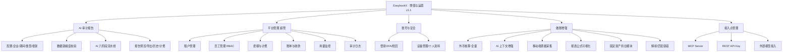
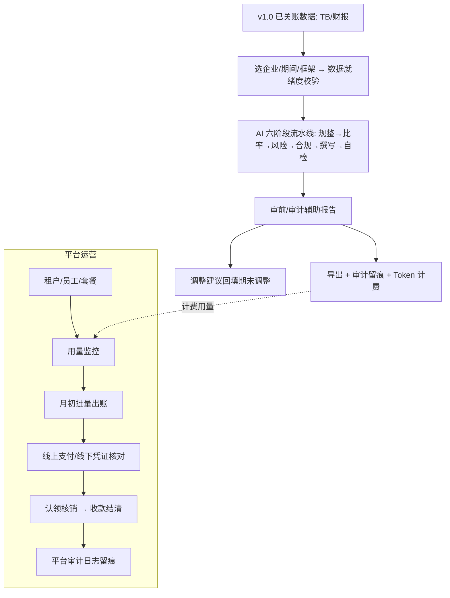

# EasybookX 产品需求文档（PRD v1.1 · 增值与运营）

| 项 | 内容 |
|---|---|
| 产品 | EasybookX · 香港中小企业财税 SaaS 平台 |
| 版本 | **v1.1**：在 [[EasybookX_产品需求文档_PRD_v1.0]]（核心做账闭环）之上的**增值与运营**能力 |
| 范围 | AI 审计报告、平台管理（租户/员工/套餐计费/账单收款/用量监控/审计日志）、账号与安全、接入点管理；**做账增强：外币全量自动化、行业上下文注入 AI、移动端票据采集、报表公式可视化、固定资产折旧、解析容错** |
| 准则 | SME-FRS / HKFRS / HKSA · Cap.622 / Cap.112 / Cap.50 / PDPO · 币种 HKD |
| 关联 | [[EasybookX_产品需求文档_PRD_v1.0]]、[[PRD_平台管理_v1.0]]、[[PRD_审计报告_v1.0]]、[[prompts_审计报告]] |
| 说明 | **TCSP 公司秘书（小程序）不属于 EasybookX 项目范围，已剔除。** |

---

## 一、产品背景与目标

### 1.1 市场背景与行业洞察

> 数据口径：行业公开资料与通行估算（香港公司注册处年报、HKICPA、审计自动化行业研究）。**联网核验暂不可用，正式发布前请复核最新数值。**

- **审前准备成本高**：香港私人公司每年须法定审计，审前整理底稿、识别风险、对照合规节点常耗时数天，依赖资深人力。
- **多客户运营难**：会计师事务所 / 记账公司同时服务数十至数百家客户公司，**权限、套餐、计费、用量、合规留痕**难以统一管理。
- **AI 审计渗透**：四大已普及 AI 分析性复核、异常检测、底稿自动化；中小所对「审前提效 + 增值变现」需求迫切。
- **合规与安全压力**：账簿须 7 年留存（Cap.622 / IRO），PDPO 个人资料保护，敏感操作须不可篡改留痕；账号需 2FA、设备管控。

### 1.2 用户目标
- **审前增值**：基于平台已沉淀的记账数据，数分钟生成审前分析/审计辅助报告（比率、分析性复核、风险、合规清单、调整建议），缩短审计工时，形成 Token 计费增值服务。
- **可经营 SaaS**：多租户 + 套餐 + Token 用量后付费 + 强对账收款，支撑事务所/SME 规模化运营与成本管控。
- **安全合规**：RBAC 权限、2FA、设备会话管控、不可篡改审计日志、7 年留存。
- **可追溯与扩展**：法定账簿钻取至原始凭证；对外开放 MCP/REST 与外部模型接入。

---

## 二、功能定义和概述

### 2.1 功能模块清单

| 功能模块 | 功能点 | 优先级 | 核心价值 |
|---|---|---|---|
| **外币核算·全量**（做账增强）| 汇率自动抓取（香港税局/HKMA 每日）、逐笔即期可选、列报币折算与折算储备、外币明细账 | P1 | 外币自动化 |
| **AI 上下文增强**（做账增强）| 行业/主营注入匹配与记账提示词、按行业的科目偏好 | P1 | 匹配准确度 |
| **移动端票据采集**（做账增强）| 扫码进 H5/小程序连拍上传、扫描仪授权目录读取（可选）| P2 | 采集效率 |
| **报表公式可视化**（做账增强）| 可视化取数公式配置界面（频繁调整/各企业独特算法）| P2 | 可配置 |
| **固定资产折旧模块**（做账增强）| 资产登记、税务免税额（首年 60% + 其后 30% 递减）、账面折旧自动计提 | P2 | 资产管理 |
| **解析/匹配容错**（做账增强）| 模型降级、自动重试、分批上传，提升解析/匹配成功率 | P1 | 稳定性 |
| **账号信息分离**（做账增强）| 企业信息（工商）与账号信息（建账/准则/科目体系）分层 | P2 | 数据建模 |
| **AI 审计报告** | 选企业/期间/类型/框架、数据就绪度校验 | P0 | 审前增值 |
| | 比率/分析性复核/风险(HKSA)/合规清单/调整建议 | P0 | 审计辅助 |
| | 历史报告、导出、Token 计费、审计留痕 | P1 | 复用变现 |
| **平台管理·租户** | 租户 CRUD、详情抽屉、暂停/恢复、风险预警 | P0 | SaaS 运营 |
| **平台管理·员工** | RBAC 五角色、邀请、编辑授权、停用、2FA | P0 | 权限安全 |
| **平台管理·套餐计费** | 套餐 CRUD、Token 计量规则、查看套餐租户 | P0 | 定价 |
| **平台管理·账单收款** | 出账、对账、线上/线下支付、认领核销、收款账户 | P0 | 收款闭环 |
| **平台管理·用量监控** | Token/OCR/存储、按租户、钻取、导出 | P1 | 成本管控 |
| **平台管理·审计日志** | 不可篡改留痕、分类/用户/日期筛选、导出 | P0 | 合规 |
| **账号与安全** | 登录/2FA/找回、设备管理、个人资料、改密 | P0 | 账户安全 |
| **接入点管理** | MCP / REST API Key、权限范围、外部模型接入 | P2 | 扩展开放 |

### 2.2 功能模型图

---

## 三、用户角色和使用场景

### 3.1 用户角色说明
| 角色 | 说明 | 主要诉求 |
|---|---|---|
| **租户管理员 tenant_admin** | 管理本所员工/公司/套餐/账单 | 权限、计费、用量统一管理 |
| **平台超级管理员** | 运营方，跨租户管理 | 经营看板、收款、合规留痕 |
| **CPA 事务所审计 / 经理** | 审前分析、底稿 | 自动化分析性复核与风险识别（仍独立判断、签署）|
| **SME 老板 / 管理者** | 看经营、审前自查 | 通俗报告、合规清单 |

### 3.2 核心使用场景

#### 场景一：AI 审计报告（审前分析）
- **痛点**：审计前整理底稿、识别风险耗时数天。
- **用户故事**：作为 CPA 审计，我希望选定客户一键生成审前分析报告，以便缩短现场审计时间。

#### 场景二：平台运营（多租户管理与收款）
- **痛点**：管理众多客户公司，权限、计费、用量、收款难统一。
- **用户故事**：作为平台超管，我希望统一管理租户/员工/套餐/账单/用量，以便高效经营 SaaS。

#### 场景三：账号安全与权限管控
- **痛点**：员工权限不清、账号被盗风险、操作无留痕。
- **用户故事**：作为租户管理员，我希望按角色授权、强制 2FA、管控登录设备并留痕，以保障账户与数据安全。

---

## 四、核心业务流程

---

## 五、功能详细说明（页面级 · 含状态说明）

> 权限按 RBAC；平台管理面向超管/租户管理员；审计报告为审前/辅助用途，**不替代 HKICPA 法定审计意见**。

### 5.1 账簿浏览（page-ledger）
- 法定账簿列表（总账/明细分类账/日记账/AR/AP/固定资产/MPF/税务等）；钻取至原始凭证。
- **状态说明**：只读视图，无独立状态变更；仅展示 `confirmed` 已确认分录；按账期 `open`/`locked` 呈现，已关账期为只读快照。

### 5.2 AI 审计报告（page-auditrpt）
- 配置（企业/FY/报告类型/框架/深度模式）+ 数据就绪度校验 + 六阶段进度 + 分章报告（免责声明/执行摘要/比率/分析性复核/风险/合规清单/调整建议/附注草稿/管理建议）+ 历史/导出/计费/留痕。详见 [[PRD_审计报告_v1.0]]。
- **状态说明**：

  | 维度 | 状态值 | 含义 / 判定规则 |
  |---|---|---|
  | 就绪度校验 | `pass` 通过 / `warn` 待处理 | 试算/资产负债平衡、已关账、银行对账缺口、票据解析、待确认调整等项；warn 可强制生成但报告标注「数据不完整」|
  | 生成状态 | `generating` 生成中（Stage 0–5）/ `done` 完成 / `failed` 失败 | 某阶段失败自动重试；自检不通过触发对应阶段重生成 |
  | 报告状态 | `draft` 草稿（含合规免责声明）| 平台报告不替代 HKICPA 法定审计意见 |

### 5.3 平台管理（page-tenants/users/plans/billing/usage/audit）
- **租户**：统计卡 + 列表（搜索/状态筛选）+ 详情抽屉 + 编辑 + 暂停/恢复 + 风险预警。
- **员工**：RBAC 五角色、邀请、编辑（角色/公司授权/2FA）、停用/恢复、重置密码、导出。
- **套餐**：数据化卡片 + 新建/编辑 + 查看套餐租户 + Token 单价可编辑。
- **账单收款**：看板 + 列表（状态机 draft→issued→proof_uploaded→paid/overdue）+ 月初批量出账 + 认领核销 + 收款账户。
- **用量监控**：时间切换、按租户明细、钻取、导出。
- **审计日志**：分类/用户/日期筛选、加载更多、详情、导出 CSV。详见 [[PRD_平台管理_v1.0]]。
- **状态说明**：

  | 子模块 | 状态值 | 含义 / 判定规则 |
  |---|---|---|
  | 租户 Tenant.status | `active` 活跃 / `trial` 试用 / `suspended` 已暂停 | 暂停后该租户全员禁登录，数据保留；试用到期或欠费触发暂停预警 |
  | 员工 User.status | `active` 活跃 / `invited` 待激活 / `disabled` 已停用 | 仅 invited 可物理删除；active 只可停用（审计完整性）|
  | 账单 BillingInvoice.status | `draft` 草稿 → `issued` 待支付 → `proof_uploaded` 待核对 → `paid` 已付款 → `receipted` 已开收据；旁支 `overdue` 逾期、`rejected` 凭证驳回 | 线上支付回调→paid；线下上传凭证→proof_uploaded，财务核对通过→paid，驳回→退回 issued |
  | 套餐 Plan | `active` 启用 / `archived` 停售 | 停售套餐不可新订，存量租户保留 |
  | 用量配额 | `normal` 正常 / `warning` ≥70% / `critical` ≥90% / `exceeded` 超额 | 触发预警与升级建议 |
  | 审计日志 | `append-only` 不可篡改 | 7 年留存，禁止 UPDATE/DELETE |

### 5.4 账号与安全（page-me + 登录）
- 登录/找回/激活；2FA 启用；登录设备列表与退出；个人资料；最近活动；修改密码（强度校验）。
- **状态说明**：

  | 维度 | 状态值 | 含义 / 判定规则 |
  |---|---|---|
  | 账号状态 | `active` 正常 / `locked` 已锁定 / `disabled` 已停用 | 连续登录失败达阈值锁定；停用不可登录 |
  | 激活状态 | `invited` 待激活 → `active` 已激活 | 邀请邮件 7 天有效，过期失效 |
  | 会话/设备 | `active` 在线 / `current` 本机 / `revoked` 已退出 / `expired` 已过期 | 改密或「退出其它设备」→ 其余会话 revoked |
  | 2FA | `enabled` 已开启 / `disabled` 未开启 | 可由租户管理员强制要求 |

### 5.5 接入点管理（page-settings）
- MCP Server / REST API Key 管理（创建/启用/停用/吊销、权限范围 scope、调用配额）；外部模型接入（LLM / OCR / NLP 提供方与密钥配置）；接口基础地址。
- **状态说明**：

  | 维度 | 状态值 | 含义 / 判定规则 |
  |---|---|---|
  | API Key | `active` 启用 / `disabled` 停用 / `revoked` 已吊销 | 吊销后立即失效不可恢复；密钥仅显示前后片段 |
  | 接入点 | `connected` 已连接 / `disconnected` 未连接 / `error` 异常 | 健康检查失败置 error |
  | 权限范围 scope | `read` 只读 / `write` 可写（授权分录）| 决定外部系统可调用的操作集 |
  | 外部模型 | `enabled` 已启用 / `disabled` 未启用 | 按租户配置，缺省走平台内置模型 |

---

## 六、异常处理

| 场景 | 处理策略 | 提示 |
|---|---|---|
| 审计报告数据未就绪 | 警示可强制 | 数据不完整，仍要生成？ |
| 审计报告阶段失败 | 自动重试/降级 | Stage X 失败，正在重试 |
| 越权操作 | 按 RBAC 隐藏/禁用 | 当前角色无权限 |
| Token 配额不足 | 阻断 AI 功能 | 配额不足，请升级套餐 |
| 租户暂停后登录 | 阻断登录 | 租户已暂停，请联系管理员 |
| 账单凭证不符 | 驳回，退回待支付 | 凭证驳回：金额/附言不符 |
| 未匹配付款 | 进未匹配池待认领 | 附言缺账单号，请认领核销 |
| 删除已激活账号 | 禁止，仅可停用 | 已激活账号只能停用 |
| 个人资料/含个资导出 | 二次确认（PDPO）| 含个人资料，确认导出？ |
| API Key 泄露/吊销 | 立即失效 | 密钥已吊销，请重新生成 |

---

## 七、数据埋点方案

| 触发时机 | 业务意义 |
|---|---|
| 生成 AI 审计报告 | 增值功能转化 / 计费 |
| 审计报告各阶段耗时/失败 | 流水线性能监控 |
| 调整建议「回填期末调整」 | 审前→记账闭环转化 |
| 导出报告（PDF/Word/Excel）| 交付转化 |
| 租户 创建/暂停/编辑 | SaaS 经营动作 |
| 员工 邀请/停用/角色变更 | 权限与安全审计 |
| 套餐 新建/改价/Token 单价调整 | 定价策略分析 |
| 账单 出账/支付/核销/驳回 | 收款健康度 / MRR |
| 用量 钻取/导出 | 成本管控 |
| 登录/2FA 启用/异地登录/退出设备 | 账户安全监控 |
| API Key 创建/吊销 / 外部接入调用 | 开放生态使用度 |

> 统一上报字段建议：`user_id / tenant_id / company_id / module / action / result / duration_ms`，支持按租户、模块、角色多维分析。

---

## 八、非功能性与合规
- **多租户隔离**：所有查询隐含 `tenant_id`，超管显式跨租户。
- **审计留痕**：敏感操作 append-only，7 年留存（Cap.622 / IRO S.51C / PDPO）。
- **数据安全**：发送模型前脱敏（身份证/银行全账号/个人电话）；API Key 仅显示前后片段。
- **合规边界**：平台出具账目与管理/审前报告，**不替代 HKICPA 法定审计意见**。
- **AI 可解释**：每次 AI 推荐/报告保存模型、提示词版本、置信度与字段来源。
- **币种/税务**：统一 HKD，香港不征 GST/VAT；利得税两级 8.25%/16.5%。
- **i18n**：简体 / 繁體 / English。

---

## 九、变更记录（Change Log）

> 记录 v1.1 范围调整，按模块归类、附原因与影响。来源：客户评审会（2026-06-24 / 06-25）。

### C1 · 移除「账簿浏览」（下移至 v1.0「账簿管理」）
- **变更**：法定账簿（总账/明细/日记/AR/AP/固定资产等）由 v1.1 移出，并入 v1.0「账簿管理」（核心做账闭环必需、按企业账套隔离）。
- **原因**：Cap.622 S.373 法定纪录属做账闭环必需，非增值运营项。
- **影响**：v1.1 §2.1 移除「账簿浏览」；详见 [[EasybookX_产品需求文档_PRD_v1.0]] §九 C1、[[PRD_账簿_v1.0]]。

### C2 · 新增「做账增强」一组（v1.1 下一步）
将以下能力明确纳入 v1.1，作为 v1.0 做账闭环之上的增强：
| 项 | 说明 | 来源 |
|---|---|---|
| **外币核算·全量** | 汇率每日自动抓取、逐笔即期可选、列报币折算+折算储备、外币明细账（v1.0 已落地汇率政策 + 期末重估基础）| 6/25 会议、HKAS 21 |
| **AI 上下文增强** | 行业/主营注入匹配与记账提示词（v1.0 已采集字段，v1.1 注入 AI）| 6/24 会议 |
| **移动端票据采集** | 扫码 H5/小程序连拍上传、扫描仪授权目录读取（可选、不强依赖）| 6/24 会议 |
| **报表公式可视化** | 像财云的可视化取数公式配置界面，供频繁调整/各企业独特算法 | 6/25 会议 |
| **固定资产折旧模块** | 资产登记 + 税务免税额（60%/30% 递减）+ 账面折旧自动计提（v1.0 暂手工补录）| 6/24 会议 |
| **解析/匹配容错** | 模型降级、自动重试、分批，提升 ~80% 成功率与稳定性 | 6/25 会议 |
| **账号信息分离** | 企业信息（工商）与账号信息（建账/准则/科目体系）分层建模 | 6/25 会议 |

### C3 · 不变项
AI 审计报告、平台管理、账号与安全、接入点管理 范围与定位不变；**TCSP 公司秘书（小程序）仍不属于 EasybookX 项目**。
