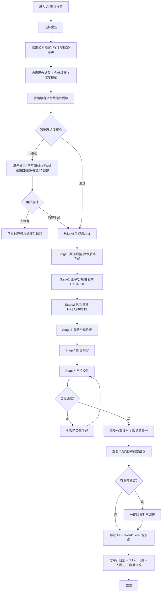

# EasybookX · AI 审计报告模块 产品需求文档（PRD v2.0 完整版）

| 项 | 内容 |
|---|---|
| 产品 | EasybookX 利柏思 · 香港中小企业财税 SaaS 平台 |
| 模块 | AI 审计报告（Audit Report）|
| 文档版本 | v2.0（完整版，按六技能框架）|
| 适用准则 | SME-FRS / HKFRS · HKSA · Cap.622 / Cap.112 |
| 关联文档 | [[PRD_审计报告_v1.0]]、[[prompts_审计报告]]、[[PRD_平台管理_v1.0]] |
| 状态 | Draft → Review |

> ⚠️ **合规前提（贯穿全文）**：香港法定审计意见只能由 HKICPA 注册执业会计师依《香港审计准则》(HKSA) 签发。本模块输出定位为 **审前分析 / 审计辅助 / 意见书草稿模板**，**不构成法定审计意见**，每份报告首页强制免责声明、导出件加水印。

---

## 一、产品背景与目标

### 1.1 市场背景与行业洞察

> 数据口径：以下为行业公开资料与通行估算（来源：香港公司注册处年度统计、HKICPA、香港税务局、四大及主流审计软件厂商公开资料、审计自动化行业研究）。**联网核验暂不可用，正式对外发布前请复核最新数值。**

**市场规模与增长**
- 香港是典型的「强制审计」司法管辖区：根据《公司条例》(Cap. 622)，**几乎所有本地注册的私人有限公司每年均须接受法定审计**——这与内地、新加坡部分豁免制度不同。香港现有**活跃本地公司约 140 万家**，叠加每年数十万家新注册公司，构成庞大且**刚性**的年度审计需求。
- 全球「审计与会计自动化 / AI 审计」市场处于高速增长期：业界普遍估计该细分市场规模已达**数十亿美元级别**，**年复合增长率约 20%–30%**；四大（Deloitte/PwC/EY/KPMG）均已将 AI 分析性复核、异常检测、底稿自动化纳入核心审计流程。
- 香港会计师事务所（CPA Firm）**两极分化明显**：四大与少数中型所占据大型客户，而**数千家中小型 CPA 所 / 记账公司**服务海量 SME，**人力密集、利润薄、招聘难**，对「提效工具」需求迫切。

**行业面临的挑战**
- **审前准备耗时**：账目完整性核对、银行对账、分析性复核、识别待调整事项、整理附注高度依赖人工，一家小客户审前准备常需数天。
- **人才短缺与成本上升**：香港会计人才供给紧张，初级审计 / 记账人员流失率高，事务所人力成本逐年上涨。
- **质量与一致性风险**：人工分析易遗漏异常（cut-off、关联方、整数估列等），底稿质量参差。
- **SME 信息不对称**：中小企业老板在审计前「心里没底」，与审计师反复来回，沟通成本高。
- **合规压力**：利得税申报（BIR51）须随审计报告同步，账簿须按 Cap.622 / IRO 保存 7 年，合规节点多。

**EasybookX 的差异化机会**
- EasybookX 已沉淀企业**全量结构化记账数据**（COA、日记账、试算平衡、财报、银行流水、票据、对账、期末调整），具备「数据现成」的天然优势——无需重复采集即可在数分钟内产出高质量审前分析。
- 以**审前分析 / 审计辅助**切入（而非替代法定审计），合规、可落地，同时服务 **SME 自查** 与 **CPA 事务所提效** 两类客户，提升平台 ARPU。

### 1.2 用户目标

- **效率提升**：审前准备从「数天」压缩到「数分钟」，自动完成比率分析、分析性复核、风险识别、合规清单与调整建议，减少 **80%+** 的手工审前工作量。
- **质量可靠**：基于平台真实账目数据，「算术由系统完成、AI 只做解读」，并经自检校验防幻觉；关键风险逐条附证据（科目码 / 凭证号），降低遗漏。
- **降本增收**：CPA 事务所单客户审前工时显著下降，可承接更多客户；平台按 5,000 Token/份计费，形成高价值增值服务。
- **合规可控**：全程 HKD、香港准则语境；强制免责声明与导出水印；报告记录留痕（审计日志 + 数据指纹），满足可追溯与 PDPO 要求。
- **体验友好**：选企业 → 一键生成 → 分章预览 → 调整建议一键回填 → 导出，闭环顺滑。

---

## 二、功能定义和概述

### 2.1 功能模块清单

| 功能模块 | 功能点 | 优先级 | 核心价值 |
|---------|--------|--------|----------|
| **报告配置** | 企业选择（限本租户、已初始化） | P0 | 锁定数据范围 |
| | 财政年度 FY 识别（读公司档案） | P0 | 期间正确 |
| | 报告类型选择（审前/底稿/意见书草稿） | P0 | 合规定位 |
| | 会计框架选择（SME-FRS / HKFRS） | P0 | 影响附注与披露 |
| | 深度模式开关（Opus/Sonnet） | P1 | 复杂主体增强 |
| **数据抓取与就绪校验** | 平台数据聚合（已脱敏） | P0 | 数据现成、零重复采集 |
| | 就绪度 Checklist（平衡/关账/对账/票据/调整） | P0 | 防止"垃圾进垃圾出" |
| | 重要性水平 (materiality) 计算 | P1 | 分析阈值依据 |
| **AI 生成流水线** | 6 阶段进度可视化 | P0 | 过程透明、可信 |
| | 比率与分析性复核 (HKSA 520) | P0 | 量化经营表现 |
| | 风险与异常扫描 (HKSA 240/315，A1–A13) | P0 | 精准定位风险 |
| | 香港合规检查清单 | P0 | 法定节点不漏 |
| | 报告撰写（执行摘要/解读/附注草稿/管理建议） | P0 | 成稿可用 |
| | 自检校验（防幻觉） | P0 | 数字可核、措辞合规 |
| **报告预览与交付** | 分章节预览 + 章节目录 (TOC) | P0 | 阅读高效 |
| | 风险分级色块 / 比率卡片 | P1 | 一目了然 |
| | 调整建议「回填期末调整」 | P1 | 闭环到记账 |
| | 导出 PDF / Word / 底稿 Excel（含水印） | P0 | 交付与归档 |
| **历史与计费留痕** | 历史报告列表（查看/导出/重生成） | P1 | 复用与追溯 |
| | 生成计费（5,000 Token/份） | P0 | 商业变现 |
| | 审计日志 AUDIT_REPORT_GENERATED | P0 | 合规留痕 |
| | 数据指纹 (sha256) 快照 | P2 | 可复现 |

### 2.2 功能模型图（Mermaid）

```mermaid
graph TD
    AR[AI 审计报告模块]

    AR --> CFG[报告配置]
    AR --> DATA[数据抓取与就绪校验]
    AR --> GEN[AI 生成流水线]
    AR --> OUT[报告预览与交付]
    AR --> HIST[历史与计费留痕]

    CFG --> CFG1[企业选择]
    CFG --> CFG2[FY 识别]
    CFG --> CFG3[报告类型]
    CFG --> CFG4[会计框架]
    CFG --> CFG5[深度模式]

    DATA --> D1[平台数据聚合-脱敏]
    DATA --> D2[就绪度 Checklist]
    DATA --> D3[重要性水平]

    GEN --> G1[比率/分析性复核 HKSA520]
    GEN --> G2[风险扫描 HKSA240/315 A1-A13]
    GEN --> G3[香港合规检查]
    GEN --> G4[报告撰写]
    GEN --> G5[自检校验-防幻觉]

    OUT --> O1[分章预览+TOC]
    OUT --> O2[风险分级/比率卡片]
    OUT --> O3[调整建议回填]
    OUT --> O4[导出 PDF/Word/Excel]

    HIST --> H1[历史报告列表]
    HIST --> H2[Token 计费]
    HIST --> H3[审计日志留痕]
    HIST --> H4[数据指纹快照]
```

---

## 三、用户角色和使用场景

### 3.1 用户角色说明

| 角色 | 说明 | 在本模块的诉求 |
|---|---|---|
| **SME 老板 / 财务负责人** | 中小企业经营者 | 审计前自查经营与风险，减少与审计师来回 |
| **记账员 / 主管会计**（租户内） | 负责日常做账与期末处理 | 一键生成审前底稿，提前发现错漏并调整 |
| **CPA 事务所审计 / 经理** | 持牌所执业人员 | 自动化分析性复核与风险识别，缩短审计工时（仍独立判断、签署） |
| **平台超级管理员** | EasybookX 运营方 | 监控生成用量与计费、合规留痕 |

> 权限：仅 `tenant_admin / senior / reviewer` 可生成报告；`bookkeeper` 可生成但不可对外导出意见书草稿；`viewer` 只读历史。详见 [[PRD_平台管理_v1.0]] RBAC。

### 3.2 核心使用场景

#### 场景一：CPA 事务所审前批量分析
- **痛点**：每到报税季，一名审计需对几十家 SME 客户逐户做审前分析，重复且易遗漏异常，工时高、质量不稳。
- **用户故事**：作为 CPA 事务所审计，我希望选定客户公司一键生成审前分析报告（含比率、分析性复核、风险清单、调整建议），以便快速判断重点、缩短现场审计时间。
- **流程图（Mermaid）**：

#### 场景二：SME 老板年度审计前自查
- **痛点**：老板看不懂账，审计前心里没底，被审计师追问资料时手忙脚乱。
- **用户故事**：作为 SME 老板，我希望在审计前生成一份通俗的经营与风险概览，以便提前补齐资料、心中有数。
- **流程图（Mermaid）**：

#### 场景三：主管会计调整建议回填闭环
- **痛点**：发现待调整事项后，还要手工回到记账模块逐条录入，重复劳动。
- **用户故事**：作为主管会计，我希望报告中的调整建议能一键回填到「期末调整」，以便直接确认入账。
- **流程图（Mermaid）**：

---

## 四、核心业务流程

---

## 五、功能详细说明（页面级）

### 5.1 「① 生成配置」页面（左侧卡片）

页面内容包含：
- **选择企业**
  - 下拉选择，必填
  - 数据源：仅当前租户下、**已完成初始化**的公司；默认选中第一家
  - 选择后联动刷新：FY 区间、会计框架默认值、就绪度校验
- **财政年度 (FY)**
  - 只读展示，自动读取 `CompanyProfile.fy_start / fy_end`（香港常见 3-31 / 12-31）
  - 格式：`2025-04-01 ~ 2026-03-31`
- **基准币种**
  - 只读，固定 `HKD`（香港不征 GST/VAT）
- **报告类型**（chip 单选，必填，默认「审前分析报告」）
  - 选项：审前分析报告 / 审计辅助底稿 / 意见书草稿模板
  - 选「意见书草稿模板」时：生成内容追加 HKSA 700 结构占位 + 「[草稿 DRAFT — 待执业会计师审阅签署]」标注；普通角色不可对外导出
- **会计框架**（chip 单选，必填）
  - 选项：SME-FRS / HKFRS；默认随企业档案；影响附注草稿与披露建议
- **深度模式**（开关，默认关）
  - 开：使用 `claude-opus-4-8`（复杂/大额主体）；关：`claude-sonnet-4-6`
- **生成按钮**
  - 主按钮「生成审计报告（计费 5,000 Token）」
  - 点击前置校验：企业已选、报告类型与框架已选
- **异常提示**
  - 「请先选择企业」「该企业尚未完成初始化，无法生成」「请选择报告类型 / 会计框架」

### 5.2 「② 数据就绪度校验」页面（右侧卡片）

页面内容包含：
- **就绪度结果列表**（实时渲染，每项含 通过/待处理 标识与说明）
  - 试算平衡（借贷差额 < HKD 0.01）
  - 资产负债表平衡（资产 = 负债 + 权益）
  - 目标期间已关账（period locked）
  - 银行未对账项 < 5%
  - 票据解析无失败（无 parse_status ≠ done）
  - 无待确认期末调整（无 pending ADJ）
- **就绪度汇总徽标**：`N / M 通过`（全通过绿色，否则橙色）
- **交互**：不通过项可点击跳转对应模块修复；保留「仍要生成」入口（报告将标注「数据不完整」）
- **异常提示**：「试算不平衡，差额 HKD X，建议先平账」「银行未对账 X 笔，超过 5% 阈值」

### 5.3 「③ AI 生成流水线」卡片（生成中显示）

页面内容包含：
- **顶部信息条**：所用模型、报告类型、会计框架
- **6 阶段步进器**（逐项：等待 ○ → 进行中 ⟳ → 完成 ✓）
  - Stage 0 抓取并规整平台数据（已脱敏）
  - Stage 1 财务比率与分析性复核 (HKSA 520)
  - Stage 2 风险与异常扫描 (HKSA 240)
  - Stage 3 香港合规检查
  - Stage 4 报告撰写
  - Stage 5 自检校验（防幻觉）
- **状态**：每阶段约数百毫秒推进（前端模拟；真实接入见 [[prompts_审计报告]] 流水线）
- **异常提示**：「Stage X 生成失败，正在重试 / 已回退」

### 5.4 报告预览区（生成完成显示）

页面内容包含：
- **报告抬头卡**：报告类型、公司名 / BR No / FY / 框架 / HKD、**数据质量分（0–100，颜色分档）**、「导出 PDF」按钮
- **免责声明（红框，强制置顶，不可关闭）**
- **章节（分卡片）**：
  1. 执行摘要 Executive Summary（3–6 条要点）
  2. 财务报表概览（收入/成本/毛利/费用/净利 + 同比；资产/负债/权益 + 平衡标识）
  3. 关键财务比率与分析（毛利率/净利率/流动比率/速动比率/DSO/DPO/ROE/资产负债率 + 常识区间 + 解读）
  4. 风险与异常事项（A1–A13；代码/风险项/等级色块/证据/准则引用）
  5. 香港合规检查清单（BR/NAR1/PTR(BIR51)/暂缴税/MPF/账簿 7 年/审计委任/报告豁免资格 + 状态）
  6. 待调整事项与审计调整建议（建议分录 + 金额 + **「回填期末调整」按钮**）
  7. 附注草稿（按 SME-FRS / HKFRS 列关键附注骨架，标注「待补全」）
  8. 管理建议 Management Letter（内控/流程改进要点；意见书草稿类型追加 HKSA 700 结构占位）
- **字段规则**：所有金额取自后端聚合数据，前端不二次计算；风险等级高=红/中=橙/低=灰
- **异常提示**：「报告渲染失败，请重试」「调整建议借贷不平，已拦截回填」

### 5.5 历史报告区

页面内容包含：
- **历史报告表**：报告号 / 企业 / 期间 / 类型 / 质量分 / 操作
  - 报告号：`AR-YYYY-NNNN`，等宽字体
  - 操作：查看（重渲染快照）、导出、重生成
- **数据源**：`GET /api/audit-reports`（生成后 `POST` 入库）
- **异常提示**：「暂无历史报告」「报告快照已失效，请重新生成」

---

## 六、异常处理

| 异常场景 | 触发条件 | 处理策略 | 用户提示 |
|---|---|---|---|
| 未选企业 | 点生成时企业为空 | 阻断生成 | 请先选择企业 |
| 企业未初始化 | 公司无 COA / 期初 | 阻断生成 | 该企业尚未完成初始化 |
| 试算/报表不平衡 | 借贷差额 ≥ 0.01 或 BS 不平 | 校验置「待处理」，可仍生成但标注 | 试算不平衡（差额 HKD X），建议先平账 |
| 未关账 | 目标期间未 locked | 校验「待处理」 | 目标期间尚未关账，结果可能不完整 |
| 银行对账缺口 | 未匹配 ≥ 5% | 校验「待处理」 | 银行未对账 X 笔，超过阈值 |
| 票据解析失败 | parse_status ≠ done | 校验「待处理」 | 存在 X 张票据解析失败 |
| 待确认调整 | 有 pending ADJ | 校验「待处理」 | 有 X 条期末调整待确认 |
| AI 阶段失败 | 某 Stage 异常/超时 | 自动重试该阶段，超限则降级提示 | Stage X 失败，正在重试 |
| 自检不通过 | 数字不符/措辞越界/调整不平 | 触发对应阶段重生成 | 报告校验未通过，正在重生成 |
| 调整建议不平 | 借≠贷 | 拦截回填 | 调整建议借贷不平，无法回填 |
| 越权导出意见书草稿 | 角色权限不足 | 隐藏/禁用导出 | 当前角色无对外导出权限 |
| Token 不足 | 租户配额耗尽 | 阻断生成 | Token 配额不足，请升级套餐 |
| 后端不可达 | API 失败 | 前端回退本地演示数据并提示 | 网络异常，已使用本地缓存（演示） |
| 数据脱敏失败 | 含未脱敏个人资料 | 阻断发送模型 | 检测到敏感信息，已暂停（PDPO） |

---

## 七、数据埋点方案

| 触发时机 | 业务意义 |
|---|---|
| 进入 AI 审计报告页 | 模块访问量 / 入口转化 |
| 切换选择企业 | 高频分析企业分布 |
| 选择报告类型 / 会计框架 | 报告类型偏好分析 |
| 开启深度模式 | 高阶（Opus）使用率与成本评估 |
| 点击「生成审计报告」 | 生成意图量 / 转化漏斗起点 |
| 就绪度校验未通过仍生成 | 数据质量风险监控 |
| 各 Stage 开始 / 完成 / 失败 | 流水线性能与失败率监控 |
| 自检不通过触发重生成 | 防幻觉有效性评估 |
| 报告生成成功 | 核心成功指标 / 计费触发 |
| 生成耗时（首字 / 总时长） | 性能体验优化 |
| 查看各章节（展开/滚动到风险/比率） | 章节价值评估 |
| 点击「回填期末调整」 | 闭环转化 / 功能粘性 |
| 导出 PDF / Word / Excel | 交付转化 / 报告类型偏好 |
| 历史报告 查看 / 重生成 | 复用率 / 满意度间接信号 |
| Token 计费成功 | 收入核算 / ARPU |
| 生成失败 / 配额不足 | 流失与瓶颈分析 |

> 埋点统一上报字段建议：`user_id / tenant_id / company_id / report_type / framework / deep_mode / score / duration_ms / result`，便于按租户与报告类型多维分析。

---

## 附：与现有实现的对应

- 本 PRD 对应 EasybookX 已上线原型的「AI 审计报告」模块（导航 `ni-auditrpt` → 页面 `page-auditrpt`）。
- 生成逻辑当前为**前端模拟**（6 阶段动画 + 模板化输出），真实 AI 接入的提示词流水线见 [[prompts_审计报告]]；生成记录已通过 `POST /api/audit-reports` 持久化。
- 计费规则（5,000 Token/份）见 [[PRD_平台管理_v1.0]] §3.3 Token 计量规则。
