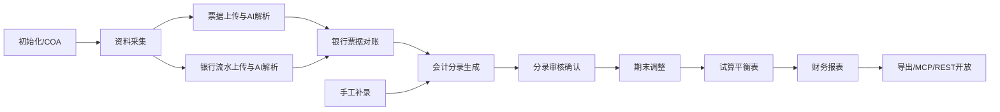
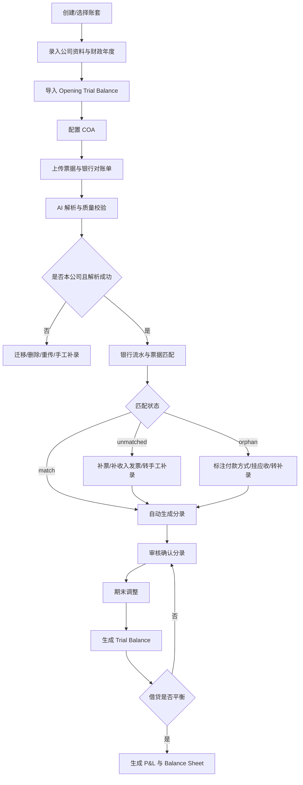
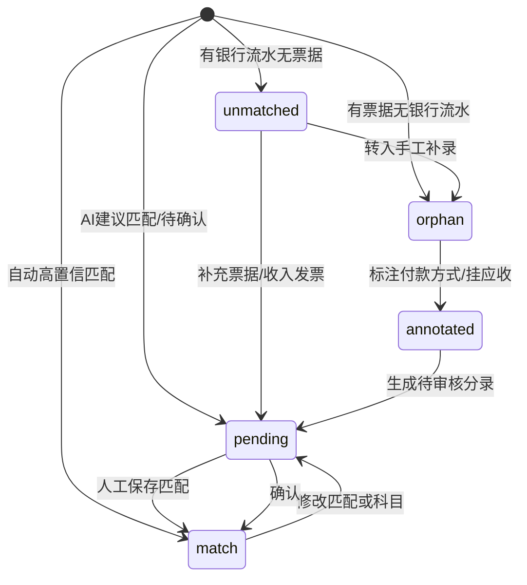
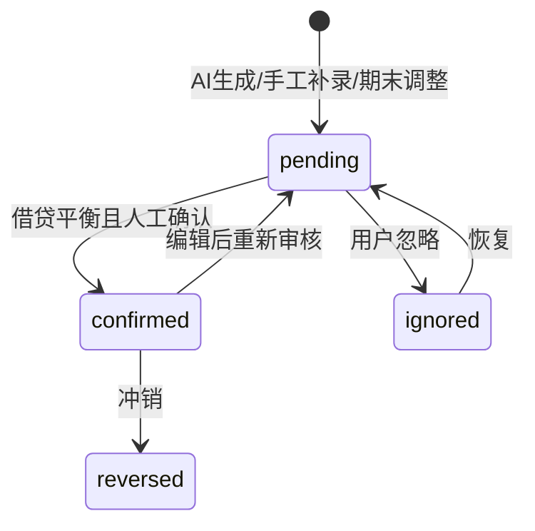

# Leapex 利柏思商务：香港票据 AI 解析与对账系统需求文档

版本：V1.0  
依据文件：`/Users/xiayu/Downloads/未命名文件夹/Leapex-2_3.html`  
适用范围：香港中小企业、会计服务公司、公司秘书/财务外包团队的月结、季结、年结做账流程

## 1. 产品背景和目标

### 1.1 产品背景

香港中小企业做账通常依赖银行月结单、销售发票、费用发票/收据、现金/董事垫付款记录和期初试算表。传统流程存在以下痛点：

- 票据和银行流水分散，人工 OCR、分类、匹配耗时。
- 香港公司财政年度可自定义，首个财政年度可长达 18 个月，系统需要支持非自然年账期。
- 香港常见实务使用 Trial Balance 作为期初和期末核心工作底稿，而非大陆式科目余额表。
- 银行流水、收入发票、费用票据之间存在一对一、一对多、多对一、无票据流水、无流水票据等复杂场景。
- 董事代付、现金付款、已开票未收款、银行手续费、利息收入等香港 SME 做账场景需要标准化生成分录。
- 期末还需补充折旧、预提、摊销、暂估、利得税等调整后，才能生成试算平衡表和 SME-FRS 财务报表。

### 1.2 产品目标

Leapex 的目标是将香港 SME 做账从“资料采集 -> AI 解析 -> 银行票据匹配 -> 会计分录 -> 期末调整 -> 试算平衡 -> 财务报表”串成一条可审计、可复核、可导出的闭环。

核心目标：

- 将票据和银行流水解析自动化，减少人工录入。
- 根据香港标准 COA 和 SME-FRS 口径自动推荐会计科目。
- 将银行流水、收入发票、支出票据、手工补录统一转化为借贷平衡的 Journal Voucher。
- 明确每一笔业务状态，做到待处理项可追踪、可迁移、可补录、可确认。
- 支持 Opening Trial Balance、期末调整、Trial Balance、P&L、Balance Sheet 的连续生成逻辑。
- 对外开放 MCP/REST 接入点，对内支持多模型 AI 接入。

## 2. 数据指标体系设计与埋点方案

### 2.1 北极星指标

账期自动化完成率 = 已自动生成且确认的有效分录数 / 本账期应处理业务总数。

该指标衡量系统将原始资料转成可出报表账务结果的能力。

### 2.2 核心业务指标

| 指标域 | 指标 | 口径 |
|---|---|---|
| 采集 | 票据上传数 | 成功进入待解析列表的票据文件数 |
| 采集 | 银行对账单上传数 | 成功进入待解析列表的银行文件数 |
| 解析 | 票据解析成功率 | 解析成功票据数 / 票据解析尝试数 |
| 解析 | 银行解析成功率 | 解析成功银行文件数 / 银行解析尝试数 |
| 解析 | AI 低置信度率 | AI 置信度低于阈值的文件数 / 解析成功文件数 |
| 数据质量 | 非本公司资料率 | 检测为非当前账套文件数 / 上传文件数 |
| 数据质量 | 疑似重复票据数 | 被标记为重复的票据数 |
| 对账 | 匹配率 | match/annotated 数 / 对账业务总数 |
| 对账 | 待补票数 | unmatched 且银行出项流水无票据的数量 |
| 对账 | 待补收入发票数 | unmatched 且银行进项流水无收入发票的数量 |
| 对账 | 孤票处理率 | annotated 孤票数 / orphan 孤票数 |
| 分录 | 分录确认率 | confirmed 分录数 / generated 分录数 |
| 分录 | 分录不平衡次数 | 保存或确认时借贷不平衡的拦截次数 |
| 期末 | 调整完成率 | confirmed 调整分录数 / 建议调整分录数 |
| 报表 | TB 平衡次数 | 生成 TB 且 Dr=Cr 的次数 |
| 报表 | 财报导出数 | P&L/B/S Excel、PDF 导出次数 |
| 效率 | 单账期完成时长 | 从首个资料上传到报表导出的时间 |

### 2.3 埋点事件设计

| 事件名 | 触发时机 | 关键属性 |
|---|---|---|
| `company_selected` | 切换账套 | company_id, company_name, period |
| `invoice_file_uploaded` | 票据进入待解析列表 | file_type, file_size, company_match, duplicate_flag |
| `invoice_parse_started` | 点击一键解析或单票解析 | file_count, model_provider |
| `invoice_parse_completed` | 票据解析完成 | success_count, failed_count, avg_confidence, low_confidence_count |
| `bank_file_uploaded` | 银行文件进入待解析列表 | bank_detected, company_match, page_count, page_complete |
| `bank_parse_completed` | 银行解析完成 | bank, account_no_hash, txn_count, ending_balance, success |
| `non_own_file_migrated` | 点击一键迁移 | source_company, target_company, file_type |
| `recon_match_saved` | 保存银行/票据关联 | match_type, pair_count, txn_count, invoice_count, status_before, status_after |
| `orphan_invoice_annotated` | 孤票标注付款方式 | invoice_type, pay_method, amount |
| `manual_entry_created` | 手工补录收入/费用 | entry_type, dr_code, cr_code, amount, currency |
| `journal_entry_generated` | 自动生成分录 | source_type, jv_id, dr_total, cr_total, balanced |
| `journal_entry_confirmed` | 确认分录 | jv_id, source_type, confidence |
| `journal_entry_edited` | 编辑分录 | jv_id, line_count, balanced_after |
| `period_adjustment_confirmed` | 确认期末调整 | adjustment_type, jv_id, amount |
| `trial_balance_generated` | 生成试算平衡表 | period, dr_total, cr_total, balanced |
| `financial_report_generated` | 生成财报 | report_type, period, standard |
| `export_completed` | 导出数据 | export_type, period, format |

### 2.4 数据采集原则

- 不采集完整银行账号、API Key、票据图片原文等敏感数据；账号使用 hash 或尾号。
- 账务金额、状态、科目代码可采集用于产品分析，但需按租户隔离。
- 所有 AI 解析结果需保留置信度、模型版本、人工修正字段，用于准确率回溯。
- 状态变更事件需记录 `before_status` 与 `after_status`，便于审计链路追踪。

## 3. 用户故事与核心场景说明

### 3.1 角色

- 会计助理：上传资料、检查解析、处理未匹配项、录入现金/董事垫付。
- 资深会计/主管：审核分录、确认期末调整、生成 TB 和财报。
- 客户公司财务联系人：补充缺失票据、确认收入发票和付款方式。
- 系统管理员：维护 COA、账套、API/MCP 接入点和 AI 模型配置。
- 外部 AI/审计工具：通过 MCP/REST 查询账务、TB、报表或写入授权分录。

### 3.2 用户故事

- 作为会计助理，我希望批量上传票据并由 AI 自动识别商户、日期、金额、币种、发票号、票据类型和费用类别，以减少人工录入。
- 作为会计助理，我希望系统识别票据是否属于当前账套，避免把其他客户资料记入错误公司。
- 作为会计助理，我希望上传银行对账单后自动识别香港银行、账号、账期、交易笔数和期末余额。
- 作为会计助理，我希望银行流水和票据可以自动匹配，并支持一对多或多对一匹配。
- 作为会计主管，我希望所有 AI 生成分录必须经过待审核/已确认状态，且保存时强制借贷平衡。
- 作为香港会计，我希望系统支持 Director's Current Account、Petty Cash、Accounts Receivable、Accrued Charges、Profits Tax Payable 等香港常见科目。
- 作为主管，我希望期末调整、TB 和财报存在前置校验，未完成待处理项时不能直接出正式报表。

## 4. 功能定义和概述

### 4.1 功能模块清单

| 模块 | 功能点 | 说明 |
|---|---|---|
| 工作台 | 多公司账套、进度总览、待办异常 | 展示公司做账进度、匹配率、待补票、待审核分录、期末调整状态 |
| 初始化 | 公司资料、BR No.、财政年度、首年建账、结账周期、本位币、Opening Trial Balance | 支持香港首年最长 18 个月，支持月结/季结/年结 |
| COA 科目表 | 标准 COA、L1/L2/L3 层级、搜索、筛选、新增、编辑、停用、导入导出 | L1 汇总不可入账，L2/L3 可入账；按资产/负债/权益/收入/费用分类 |
| 票据上传解析 | 拖拽上传、待解析列表、非本公司检测、重复票据提示、AI 解析、人工编辑 | 支持 JPG/PNG/GIF/WebP/PDF，识别中英繁混合票据 |
| 银行流水上传 | 上传对账单、银行/账号识别、页数完整性、非本公司检测、解析进度、已解析列表 | 支持 HSBC、恒生、中银等香港主流银行 |
| 银行票据会计分录 | 三栏对账：银行流水、票据池、会计分录；匹配、标注、转补录、确认 | 支持 match、pending、unmatched、orphan、annotated |
| 手工补录分录 | 费用补录、收入补录、Excel 模板、批量导入、编辑、删除、批量确认 | 处理现金、董事垫付、利息收入等无银行/无票据场景 |
| 会计分录 | 对账来源、Journal Voucher、编辑分录行、平衡校验、确认、忽略、冲销、导出 | 状态包括 pending、confirmed、ignored |
| 期末调整 | 折旧、预付摊销、应计费用、MPF、审计费、利得税、暂估、其他调整 | 确认后进入调整后 TB |
| 试算平衡表 | 按账期生成 Adjusted Trial Balance、借贷合计、净余额、平衡标识、导出 | Dr 合计必须等于 Cr 合计 |
| 财务报表 | P&L、Balance Sheet、期间切换、Excel/PDF 导出 | 按香港 SME-FRS 口径展示 |
| 接入点管理 | MCP/REST 对外开放、API Key、权限范围、外部模型接入点 | 支持外部 AI 查询账务或配置内部 AI 模型 |
| 多语言 | 简体、繁体、英文 | 导航和核心页面文案切换 |

### 4.2 功能模块图

### 4.3 数据结构

#### Company 账套

| 字段 | 类型 | 说明 |
|---|---|---|
| `company_id` | string | 账套 ID |
| `company_name` | string | 公司名称 |
| `br_no` | string | 商业登记证号 |
| `base_currency` | enum | HKD/USD/CNY |
| `fy_start_month` | int | 财政年度起始月 |
| `first_year_flag` | boolean | 是否首年建账 |
| `first_fy_start/end` | date | 首个财政年度区间，最长 18 个月 |
| `closing_frequency` | enum | monthly/quarterly/annually |

#### COA 科目

| 字段 | 类型 | 说明 |
|---|---|---|
| `code` | string | 科目代码 |
| `name_en/name_zh` | string | 英文/中文科目名 |
| `level` | int | L1/L2/L3 |
| `parent_code` | string | 父级科目 |
| `category` | enum | A/L/E/I/X |
| `normal_balance` | enum | Dr/Cr |
| `postable` | boolean | 是否允许直接入账 |
| `active` | boolean | 是否启用 |

#### Invoice 票据

| 字段 | 类型 | 说明 |
|---|---|---|
| `invoice_id` | string | 票据 ID |
| `company_id` | string | 所属账套 |
| `file_name/file_url` | string | 文件信息 |
| `merchant/counterparty` | string | 商户/交易对方 |
| `invoice_no` | string | 发票号 |
| `date` | date | 交易日期 |
| `currency` | enum | HKD/USD/CNY/EUR/GBP |
| `amount/tax_amount` | decimal | 金额/税额 |
| `invoice_type` | enum | income/expense/unknown |
| `category` | string | AI 分类 |
| `parse_status` | enum | staged/parsing/success/failed/edited |
| `ai_confidence` | number | AI 置信度 |
| `company_match` | boolean | 是否本公司 |
| `duplicate_flag` | boolean | 是否疑似重复 |

#### BankStatement / BankTransaction

| 字段 | 类型 | 说明 |
|---|---|---|
| `statement_id` | string | 对账单 ID |
| `bank` | string | HSBC/恒生/中银等 |
| `account_no_hash` | string | 银行账号脱敏 |
| `account_type` | string | 往来/储蓄/外汇/定期 |
| `period_month` | string | 账期 |
| `page_count/total_pages` | int | 页数完整性 |
| `ending_balance` | decimal | 期末余额 |
| `parse_status` | enum | staged/parsing/success/failed |
| `transactions[]` | array | 流水明细 |

BankTransaction 字段：`txn_id`, `date`, `description`, `direction(in/out)`, `currency`, `amount`, `balance`, `match_status`。

#### ReconPair 对账关系

| 字段 | 类型 | 说明 |
|---|---|---|
| `pair_id` | string | 匹配关系 ID |
| `period` | string | 账期 |
| `status` | enum | match/pending/unmatched/orphan/annotated |
| `txn_ids[]` | array | 关联流水，可为空 |
| `invoice_ids[]` | array | 关联票据，可为空 |
| `pay_method` | enum | director/cash/ar/bad_debt/cross_period/manual_transfer |
| `suggested_account_code` | string | AI 推荐科目 |
| `journal_voucher_id` | string | 已生成分录 ID |

#### JournalEntry 会计分录

| 字段 | 类型 | 说明 |
|---|---|---|
| `jv_id` | string | JV 编号 |
| `date` | date | 分录日期 |
| `period` | string | 账期 |
| `description` | string | 摘要 |
| `source_type` | enum | bank_invoice/manual/adjustment/opening |
| `source_id` | string | 来源 ID |
| `status` | enum | pending/confirmed/ignored/reversed |
| `confidence` | number | AI 置信度 |
| `lines[]` | array | 借贷分录行 |

JournalEntryLine 字段：`line_id`, `type(Dr/Cr)`, `account_code`, `amount`, `currency`。

## 5. 核心业务流程图

### 5.1 账期处理主流程

### 5.2 对账状态流转

### 5.3 分录状态流转

## 6. 功能细节、状态、交互和异常处理

### 6.1 初始化

功能：

- 录入公司名称、BR No.、本位币、财政年度起月、首个账期、结账周期。
- 支持“首年建账”开关；首个财政年度可自定义且不得超过 18 个月。
- 导入上一账期的 Closing Trial Balance 作为 Opening Trial Balance。
- Opening TB 采用借方余额/贷方余额两列录入，借贷合计必须相等。

异常：

- 首年账期超过 18 个月：提示违反香港首年财政年度规则。
- Opening TB 不平衡：禁止初始化完成，提示差额和建议检查 Retained Earnings、Share Capital、应收应付等科目。
- 科目不存在：提示先在 COA 创建或选择有效科目。

### 6.2 COA 科目表

功能：

- L1 一级分组仅用于汇总，不允许直接入账。
- L2 标准科目遵循香港 SME-FRS 常用结构，可直接入账。
- L3 客户自定义科目用于银行账号、备用金、董事往来等细分。
- 可按 A 资产、L 负债、E 权益、I 收入、X 费用筛选。

交互：

- 新增 L2 时自动生成符合父级范围的代码。
- 新增 L3 时在父级 L2 下递增生成代码，如 `1002-01` 汇丰往来账户。
- 停用科目后，不再出现在补录和对账科目下拉中，但历史分录保留。

异常：

- 代码重复、父级不存在、L1 直接入账均需拦截。
- 已被分录使用的科目原则上不可删除，仅允许停用。

### 6.3 票据上传与 AI 解析

功能：

- 支持图片和 PDF 上传。
- AI 提取字段：商户、日期、金额、币种、发票号、税额、类别、票据类型、摘要、置信度。
- 检测非本公司票据、疑似重复票据、手写低置信票据。
- 解析结果可人工编辑；编辑后视为解析成功。

状态：

- `staged`：已上传待解析。
- `parsing`：AI 正在识别。
- `success`：解析成功。
- `failed`：解析失败或置信度过低。
- `edited`：人工修正完成。

异常：

- 非本公司票据：不能批量解析，需迁移、删除或切换账套。
- 疑似重复：允许保留，但必须提示用户确认。
- 低置信度或手写模糊：进入失败/待人工编辑状态。

### 6.4 银行流水上传与解析

功能：

- 支持 PDF/XLS/XLSX 银行对账单。
- 自动识别银行、账号、账户类型、账期、交易笔数、期末余额。
- 检查对账单页数完整性和公司抬头。

状态：

- `staged`：待解析。
- `parsing`：读取格式、识别银行、提取交易、完整性校验。
- `success`：已解析并导入流水。
- `failed`：解析失败。
- `non_own`：非本公司对账单。

异常：

- 非本公司对账单：需一键迁移后再解析。
- 页数不完整：提示用户补齐页面，不建议直接提交。
- 银行账号识别失败：允许人工编辑银行、账号和账期。

### 6.5 银行票据会计分录

功能：

- 三栏工作区：银行流水、票据池、会计分录。
- 支持进项/出项筛选，收入发票/支出票据筛选，待处理/已处理筛选。
- 点击行展开编辑，支持搜索并多选关联项。
- AI 根据描述和票据类型推荐 P&L 科目。

典型匹配：

- 银行付款 + 支出票据：Dr Expense / Cr Bank。
- 银行收款 + 收入发票：Dr Bank / Cr Revenue。
- 银行手续费：Dr Bank Charges / Cr Bank，可作为免票据业务。
- 银行利息收入：Dr Bank / Cr Interest Income，可作为免票据业务。
- 一笔银行付款对应多张的士票：合并生成一张分录。

异常状态：

- `unmatched` 出项流水：提示待补支出票据，可补票或转手工补录。
- `unmatched` 进项流水：提示待补收入发票，需确认客户和开票情况。
- `orphan` 支出票据：提示现金/董事垫付，默认可标注 Director's Current Account。
- `orphan` 收入发票：提示已开票未收款，可挂 Accounts Receivable。

### 6.6 手工补录

功能：

- 费用补录：日期、币种、金额、凭证号、借方费用科目、贷方付款科目、摘要、备注。
- 收入补录：日期、币种、金额、凭证号、借方收款/应收科目、贷方收入科目、客户/付款方、摘要。
- 支持现金、备用金、董事垫付、银行利息、无票据收入等场景。

状态：

- `orphan`：已录入但分录待确认。
- `matched`：对应分录已确认。

异常：

- 日期、摘要、金额为空或金额小于等于 0：禁止保存。
- HKD 大额费用超过阈值：提示可能应资本化为固定资产，而非普通费用。
- 删除补录需二次确认。

### 6.7 会计分录

功能：

- 展示对账来源与 Journal Voucher 一一对应关系。
- 支持新增/删除分录行、修改 Dr/Cr、修改科目和金额。
- 保存时强制 Dr 合计 = Cr 合计。
- 待审核分录可确认、编辑、忽略；已确认分录可编辑或冲销。

异常：

- 至少保留一条分录行。
- 日期和摘要必填。
- 借贷不平衡不得保存。
- 被忽略分录不计入 TB 和报表，恢复后重新进入待审核。

### 6.8 期末调整

功能：

- 固定资产折旧：Dr Depreciation and amortisation / Cr Accumulated depreciation。
- 预付款摊销：Dr Expense / Cr Prepayments。
- 应计费用：Dr Expense / Cr Accrued charges。
- 暂估费用：Dr Expense / Cr Accrued charges 或 Trade Payables。
- MPF、审计费、利得税等调整分录。

状态：

- `pending`：系统建议或用户新增，待确认。
- `confirmed`：确认后计入 Adjusted Trial Balance。

异常：

- 分录不平衡不得确认。
- 期末调整未完成时，TB 可预览但应提示“未调整完成”。

### 6.9 试算平衡表与财务报表

功能：

- Trial Balance 按所有 confirmed 分录和 Opening TB 汇总。
- Adjusted Trial Balance 包含期末调整。
- P&L 按收入和费用科目生成。
- Balance Sheet 按资产、负债、权益科目生成。

异常：

- TB 不平衡：禁止生成正式财报。
- 存在未确认分录：提示风险，可禁止正式导出或标记草稿。
- 报表期间必须落在公司财政年度内。

## 7. 从会计分录到期末调整、试算平衡表和财务报表的生成逻辑

### 7.1 分录生成逻辑

系统的所有账务数据最终都转化为 JournalEntry：

1. Opening Trial Balance 生成期初分录或期初余额快照。
2. 银行票据匹配生成业务分录。
3. 手工补录生成现金、董事垫付、收入补充分录。
4. 期末调整生成调整分录。

每张分录必须满足：

- 至少一条 Dr 和一条 Cr。
- Dr 金额合计等于 Cr 金额合计。
- 科目必须是 COA 中允许入账的 L2/L3 科目。
- 币种默认使用本位币 HKD；外币应扩展汇率和本位币折算字段。

常见分录模板：

| 场景 | 分录 |
|---|---|
| 银行支付费用 | Dr Expense / Cr Bank |
| 银行收取客户款 | Dr Bank / Cr Revenue |
| 已开票未收款 | Dr Accounts Receivable / Cr Revenue |
| 董事垫付费用 | Dr Expense / Cr Director's Current Account |
| 现金支付费用 | Dr Expense / Cr Petty Cash 或 Cash |
| 银行手续费 | Dr Bank Charges / Cr Bank |
| 银行利息收入 | Dr Bank / Cr Interest Income |
| 折旧 | Dr Depreciation / Cr Accumulated Depreciation |
| 审计费预提 | Dr Audit Fee / Cr Accrued Charges |
| 利得税计提 | Dr Profits Tax Expense / Cr Profits Tax Payable |

### 7.2 期末调整逻辑

期末调整在账期末执行，用于将现金制资料修正为权责发生制结果：

- 折旧：根据固定资产、折旧年限、残值和期间计算月折旧。
- 应计：对已发生未付款的费用计提负债，如审计费、MPF、租金。
- 预付摊销：对已付款但跨期受益的项目按期间摊销。
- 暂估：对未收到发票但已发生的费用暂估入账。
- 利得税：按税前利润估算香港 Profits Tax。示例原型中使用 8.25% 展示，应在正式系统支持两级制利得税规则配置。

期末调整确认后，写入 JournalEntry，`source_type=adjustment`，并进入 Adjusted Trial Balance。

### 7.3 Trial Balance 生成逻辑

1. 读取 Opening Trial Balance。
2. 汇总本期间所有 `confirmed` 且未 `reversed/ignored` 的分录行。
3. 对每个科目计算：
   - Dr 发生额合计。
   - Cr 发生额合计。
   - 按科目正常余额方向计算净余额。
4. 生成 TB：
   - 资产、费用通常为 Dr 余额。
   - 负债、权益、收入通常为 Cr 余额。
5. 校验：
   - TB 借方合计 = 贷方合计。
   - 不平衡时展示差额，禁止生成正式财报。

### 7.4 财务报表生成逻辑

P&L：

- 收入：汇总 COA category = I 的 confirmed 分录贷方净额。
- 费用：汇总 COA category = X 的 confirmed 分录借方净额。
- 税前利润 = 收入 - 费用。
- 利得税费用 = 按税务规则或调整分录确认。
- 税后净利润 = 税前利润 - 利得税费用。

Balance Sheet：

- 资产：汇总 COA category = A 的净借方余额。
- 负债：汇总 COA category = L 的净贷方余额。
- 权益：汇总 COA category = E 的净贷方余额。
- Retained Earnings 应包含期初留存收益 + 本期税后利润。
- 校验：Total Assets = Total Liabilities + Total Equity。

### 7.5 结账控制

- 数据采集完成后才能进入对账完成状态。
- 待补票、待补收入发票、孤票未标注时，不能完成分录审核。
- 待审核分录未清零时，不能正式生成 TB。
- TB 不平衡时，不能正式生成财报。
- 财报生成后，账期可标记为已结账；已结账期间原则上锁定，如需修改需走反结账或调整分录流程。

## 8. 非功能与合规要求

- 数据隔离：所有资料按租户、账套、期间隔离。
- 审计追踪：上传、解析、人工编辑、匹配、确认、导出均需记录操作人和时间。
- 权限：助理可录入和编辑草稿，主管可确认分录、期末调整和财报。
- 安全：银行账号、API Key 脱敏展示；API Key 只显示前后片段。
- AI 可解释性：每次 AI 推荐需保存模型、提示词版本、置信度和字段来源。
- 多语言：简体、繁体、英文界面与报表标题。
- 导出：支持银行流水、票据、分录、TB、P&L、B/S 的 Excel/PDF 导出。

