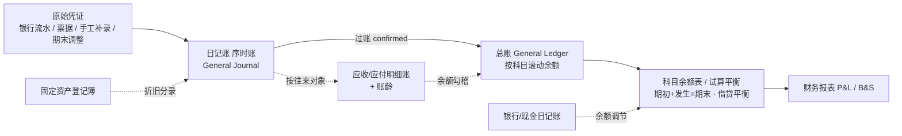

# PRD · 账簿模块 v1.0（EasybookX · 香港法定账簿体系）

> 适用：EasybookX Part A · 会计做账（香港中小企业 / 会计师事务所）
> 准则与法规：《公司条例》Cap.622 S.373、《税务条例》IRO Cap.112 S.51C、SME-FRS / HKFRS、复式记账、权责发生制、币种 HKD
> 关联：[[财务报告生成规则与说明]]、[[EasybookX_产品需求文档_PRD_v1.0]]、[[prompts_银行票据匹配会计分录]]

---

## 0. 修订记录
| 版本 | 日期 | 说明 |
|---|---|---|
| v1.0 | 2026-06-23 | 首版：账簿体系 HK 合规分析 + 现状差距 + 各账簿设计 + 路线图。原「账簿浏览」聚合页废弃，拆为标准账簿模块 |
| v1.1 | 2026-06-23 | **补齐核心缺口的完整设计**：应收/应付明细账（账龄+核销+坏账）、银行/现金日记账（含银行余额调节表）、固定资产登记簿（会计折旧 + 香港税务免税额 IA/AA）|

---

## 1. 背景与合规依据

### 1.1 为什么需要规范账簿
账簿（Books of Account）是会计核算的载体，也是香港**法定要求**：
- **《公司条例》Cap.622 S.373**：公司须备存会计记录，做到 (a) 显示并解释公司交易；(b) 合理准确披露公司财务状况；(c) 使董事能据以编制**符合条例的财务报表**。会计记录须**保存 ≥ 7 年**（S.373(6)）。
- **《税务条例》IRO Cap.112 S.51C**：经营业务者须以中文或英文备存**足够的业务记录**（含载明收支/进支的账簿、凭证、银行月结单等），保存 ≥ 7 年。
- **SME-FRS / HKFRS**：以**复式记账（有借必有贷、借贷必相等）**与**权责发生制**为基础。

### 1.2 完整账簿体系（复式记账三层结构）
香港实务下，一套完整账簿分三层，**逐层勾稽**：

| 层 | 账簿 | 作用 |
|---|---|---|
| **① 序时账（原始记录）** | 普通日记账 General Journal、现金日记账 Cash Book、银行日记账 Bank Book、（特种：销售/采购日记账）| 按**时间顺序**登记每一笔分录 |
| **② 分类账（按科目）** | 总分类账 General Ledger（总账）、明细分类账 Subsidiary Ledger（应收/应付/固定资产/存货）| 按**科目**归集，得出各科目余额 |
| **③ 汇总/报表** | 科目余额表 / 试算平衡表 Trial Balance | 汇总全部科目期初/发生/期末，校验借贷平衡，编制财报 |

> 勾稽主线：**序时日记账 → 过账总账 → 汇总科目余额表 → 试算平衡 → 财务报表**。

---

## 2. 现状与差距分析（是否符合香港会计需求）

### 2.1 现状（本期已实现）
| 账簿 | 状态 | 说明 |
|---|---|---|
| 日记账（序时账）General Journal | ✅ 已实现 | 全部分录按日期/凭证序时，借/贷科目 + 金额 + 状态 |
| 总账 General Ledger | ✅ 已实现 | 按科目逐笔 + 滚动余额（期初→本期→期末，借/贷方向）|
| 科目余额表 Trial Balance | ✅ 已实现 | 期初 + 本期借贷发生 = 期末，按类别借/贷，借贷平衡校验 |
| 试算平衡表（独立页） | ✅ 已有 | 关账门槛 |

### 2.2 差距（HK 合规仍缺，建议补强）
| 缺口 | 严重度 | 风险 / 影响 | 设计状态 |
|---|---|---|---|
| **往来明细账 + 账龄（AR/AP）** | 🔴 高 | 仅有总账汇总，无法按**客户/供应商**看明细与账龄；应收坏账、应付逾期无法管控；审计必查 | ✅ 设计已补齐（**§3.4**）|
| **银行存款日记账 + 银行调节** | 🔴 高 | 银行流水页是采集，非正式**银行日记账**；缺账面银行 ↔ 对账单余额调节，无法保证完整性 | ✅ 设计已补齐（**§3.5**）|
| **固定资产登记簿** | 🟠 中 | 折旧靠期末调整人工，缺资产台账（原值/累计折旧/净值/折旧方法/税务免税额）| ✅ 设计已补齐（**§3.6**）|
| **现金日记账（备用金）** | 🟠 中 | 现金提取→现金费用结转闭环缺台账 | ✅ 设计已补齐（**§3.5**）|
| **特种日记账（销售/采购）** | 🟡 低 | 交易量大时序时账冗长 | 可选（§7 路线图 P2）|

> 结论：当前**已实现**的「日记账 + 总账 + 科目余额表」构成最小可用合规核心（序时+分类+汇总三层）。本版（v1.1）已将审计/税局最关注的核心缺口——**AR/AP 明细账（账龄）、银行/现金日记账（含银行余额调节）、固定资产登记簿（会计折旧 + 税务免税额）**——补齐为**完整设计规格**（§3.4–§3.6），作为开发依据。

---

## 3. 各账簿详细设计

### 3.1 日记账（序时账 General Journal）✅
- **定义**：按交易发生时间顺序登记的全部会计分录（原始记账簿）。
- **字段**：日期、凭证号(JV)、摘要、借方科目(Dr)、贷方科目(Cr)、金额、状态、来源（银行票据/手工补录/期末调整/期初）。
- **规则**：每笔借贷必相等；含已确认与待确认（待确认不计入报表）；按日期+凭证号排序。
- **筛选**：全部 / 已确认 / 待确认；账期；来源。
- **数据来源**：JournalEntry（全部）。**钻取**：凭证号 → 原始凭证（票据/流水）。

### 3.2 总账（General Ledger）✅
- **定义**：按科目归集的三栏式分类账（借/贷/余额）。
- **字段**：（选定科目）期初余额 B/F、逐笔（日期/凭证/摘要/借/贷/滚动余额）、本期合计、期末余额。
- **规则**：余额按科目**正常余额方向**（资产/费用 Dr；负债/权益/收入 Cr）滚动；仅已确认分录。
- **数据来源**：JournalEntry 已确认行，按 account 归集 + COA（代码/中文/类别/正常余额）。

### 3.3 科目余额表（Trial Balance）✅
- **定义**：全部科目的期初/本期借贷发生/期末余额汇总。
- **字段**：代码、科目名称(中英)、类别(A/L/E/I/X)、期初、本期借方、本期贷方、期末（借/贷）。
- **规则**：期末 = 期初 + 本期借 − 本期贷（按正常余额方向）；**借方合计 = 贷方合计**（平衡校验）。
- **数据来源**：总账聚合。**衔接**：试算平衡 → P&L / B&S（见 [[财务报告生成规则与说明]]）。

### 3.4 应收 / 应付明细账（AR / AP Subsidiary Ledger）✅ 完整设计
- **定义**：在总账「应收账款 / 应付账款」科目之下，按**客户 / 供应商**逐户登记往来明细、核销与账龄，为坏账评估、催收、付款管理与审计提供依据。

- **页面结构**：
  - 顶部 Tab：**应收明细账 AR** / **应付明细账 AP**。
  - 汇总卡：应收/应付总额、逾期总额（>90 天）、本期已核销、未结余额。
  - 往来对象列表（按户）：对象名、BR No、未结余额、最久账龄、状态（正常/逾期/坏账）。
  - 单户钻取：该客户/供应商的逐笔单据（发票 → 收/付款核销 → 余额）。

- **字段（明细行）**：
  | 字段 | 说明 |
  |---|---|
  | 往来对象 / BR No | 客户或供应商（关联票据 counterparty）|
  | 单据类型 | 销售发票 / 采购发票 / 收款 / 付款 / 调整（坏账/折让）|
  | 单据号、日期、到期日 | 到期日 = 发票日 + 信用期（默认 30 天，可配置）|
  | 原币 / 币种 / 汇率 / 本位币金额 | 多币种支持 |
  | 应收/应付金额、已核销、**未结余额** | 未结 = 原额 − 累计核销 |
  | **账龄区间** | 由**到期日**起算落入区间 |

- **账龄分析（Aging）**：
  | 区间 | 含义 |
  |---|---|
  | 未到期 Current | 未到信用期 |
  | 1–30 天 | 逾期 1–30 |
  | 31–60 天 | 逾期 31–60 |
  | 61–90 天 | 逾期 61–90 |
  | **90+ 天** | 逾期 90 天以上（重点坏账/催收）|
  > 账龄基准可选「发票日」或「到期日」（默认到期日）。

- **核销规则（Allocation）**：收/付款按 **FIFO**（先到期先核销）自动匹配该对象的未结发票；支持部分核销与手工指定；一笔款项可核销多张发票（与银行票据匹配联动）。

- **坏账与折让（HK 实务）**：
  - 逾期/不可收回 → 计提坏账：`Dr 坏账及呆账 Bad & doubtful debts / Cr 应收账款（或坏账拨备）`。
  - SME-FRS 下按可收回性个别评估；HKFRS 9 下按预期信用损失(ECL)。坏账分录回写日记账（期末调整）。

- **勾稽**：AR 明细各户未结余额合计 **= 总账「应收账款」科目余额**；AP 同理 = 「应付账款」余额。不一致即报警（明细 ↔ 总账勾稽校验）。

- **数据来源**：销售发票 / 采购票据（票据池）+ 银行/现金收付款核销。**状态**：未核销 / 部分核销 / 已结清 / 坏账。

### 3.5 银行 / 现金日记账（Bank / Cash Book）+ 银行余额调节 ✅ 完整设计
- **定义**：按**每个银行账户 / 现金（备用金）**逐笔序时登记收支与滚动余额；并对每个银行账户出具**银行余额调节表**，保证流水完整、账实相符。

- **3.5.1 银行/现金日记账（序时 + 余额）**
  - **字段**：日期、摘要、对方、**收入(存入)**、**支出(提取)**、**滚动余额**；账户（银行+账号 / 备用金）、对应分录号、币种。
  - **多账户**：每个银行子账户、每个现金/备用金账户各一本；顶部账户选择器。
  - **现金日记账串联备用金闭环**：ATM 提现 `Dr 备用金 / Cr 银行` 入现金日记账借方；现金费用 `Dr 费用 / Cr 备用金` 入贷方；备用金余额 = 提现 − 已报支。
  - **数据来源**：已确认的银行流水分录、现金/备用金补录。

- **3.5.2 银行余额调节表（Bank Reconciliation Statement）**— 香港审计必备
  - **目的**：将**账面银行日记账余额**与**银行对账单余额**调平，差异以「在途/未达」列示。
  - **调节格式（双向，二选一作起点；以对账单余额起算示例）**：
    ```
    银行对账单期末余额 (Balance per bank statement)            X
      + 在途存款 Deposits in transit / 未入账存款               +
      − 未兑现支票 Unpresented (outstanding) cheques            −
      ± 银行已记、企业未记项                                    ±
          （银行手续费、利息、自动转账 AUTOPAY、直接扣账、
            退票 dishonoured cheque 等，企业需补登日记账）
    = 调节后余额  ==  账面银行日记账期末余额 (per cash book)     X
    ```
  - **调节项分类**：
    | 类别 | 处理 |
    |---|---|
    | 在途存款（已记账面未到银行）| 调节表加项，不入账 |
    | 未兑现支票（已记账面未过银行）| 调节表减项，不入账 |
    | 银行手续费/利息/AUTOPAY/直接借贷（银行已记账面未记）| **补登日记账**：`Dr 银行费用 / Cr 银行` 等 |
    | 退票 / 银行记账错误 | 补登或通知银行更正 |
  - **校验**：调节后余额必须 **= 账面银行日记账余额**，否则标红待查（对应 [[财务报告生成规则与说明]] §5 校验关卡 ◇V2）。

- **状态**：未调节 / 已调节平 / 有差异待查。

### 3.6 固定资产登记簿（Fixed Asset Register）+ 香港税务免税额 ✅ 完整设计
- **定义**：登记固定资产全生命周期，分列**会计折旧**与**香港税务免税额**，自动按期计提折旧并生成期末调整分录，为资产管理与利得税计算提供依据。

- **3.6.1 登记字段**
  | 分组 | 字段 |
  |---|---|
  | 资产 | 资产编号、名称、类别（如设备/家私/汽车/电脑）、购入日期、供应商、原值 Cost、币种 |
  | 会计折旧 | 折旧方法（直线 Straight-line / 递减余额 Reducing balance）、可用年限、残值、年/月折旧率、**累计折旧**、**账面净值 NBV** |
  | 处置 | 处置日期、处置价款、处置损益 |

- **3.6.2 会计折旧（账面）**
  - 直线法：月折旧 = (原值 − 残值) ÷ 使用月数。
  - 递减余额法：月折旧 = 期初净值 × 月率。
  - 系统**按月自动计提**：`Dr 折旧及摊销 / Cr 累计折旧`，回写日记账（source=期末调整），并更新累计折旧/净值。

- **3.6.3 香港税务免税额（IRO · 折旧免税额，与账面折旧分列）**
  > 香港利得税下**不认会计折旧**，改按法定免税额扣除；账面折旧须在税务计算中**加回**，再扣免税额（见 [[财务报告生成规则与说明]] 利得税）。
  - **初期免税额 IA（Initial Allowance）**：机器及设备购置当年 = **成本 × 60%**。
  - **每年免税额 AA（Annual Allowance）**：按资产法定折耗率（**10% / 20% / 30%**，多数设备/电脑为较高档）对**递减价值（结余）**计提，按**税务类别"递减结余池 Pool"**汇总计算。
  - **税务账面价值 WDV（Written-down value）**：池内结余逐年递减。
  - **处置（Balancing adjustment）**：处置时计**结余免税额 Balancing Allowance** 或 **结余课税 Balancing Charge**（处置价 vs 池内 WDV）。
  - 登记簿分列：池别(20%/30%)、IA、AA、税务 WDV，导出供利得税计算表使用。

- **勾稽**：登记簿「原值合计」「累计折旧合计」「账面净值合计」分别 = 总账固定资产 / 累计折旧科目余额；本期折旧合计 = 期末调整折旧分录合计。
- **状态**：在用 / 已处置 / 已报废。

---

## 4. 数据来源与勾稽关系


- **核心勾稽**：日记账合计 = 总账过账合计；总账各科目期末 = 科目余额表对应行；AR/AP 明细合计 = 总账应收/应付科目余额；银行日记账余额 = 银行对账单余额（经调节）。

---

## 5. 通用功能与合规要求
- **筛选**：账期 / 科目 / 日期范围 / 状态 / 往来对象。
- **钻取（drill-down）**：账簿 → 凭证 → 原始单据（票据/流水），全链可追溯。
- **导出**：Excel / PDF（中英双语标题）。
- **关账锁定**：已关账期账簿**只读快照**，修改须反结账（见 [[财务报告生成规则与说明]] §四）。
- **留存**：≥ 7 年、不可篡改（append-only 审计留痕）。
- **多币种**：外币按交易日汇率折算 HKD 入账，账簿并列原币与本位币。
- **仅 confirmed 入账**：待确认分录在日记账可见但不计入总账/科目余额/报表。

## 6. 状态与权限
| 维度 | 取值 | 说明 |
|---|---|---|
| 分录状态 | pending / confirmed / ignored / reversed | 仅 confirmed 计入分类账与报表 |
| 账期 | open / locked | 关账后账簿只读 |
| 权限 | 记账员（录入）/ 主管·审核员（确认、关账）/ 查询员（只读导出）| 按 RBAC |

## 7. 实施路线图
| 阶段 | 账簿 | 设计 | 开发 |
|---|---|---|---|
| **P0** | 日记账（序时账）、总账、科目余额表 | ✅ 完成 | ✅ 已上线 |
| **P1** | 应收/应付明细账 + 账龄 + 核销 + 坏账（§3.4）、银行/现金日记账 + 银行余额调节（§3.5）| ✅ 完成（本版补齐）| 🔶 待开发 |
| **P2** | 固定资产登记簿 + 会计折旧 + 税务免税额 IA/AA（§3.6）| ✅ 完成（本版补齐）| 🔶 待开发 |
| **P3** | 特种日记账（销售/采购）、存货明细账 | 规划中 | 🔶 规划 |

> 本期已将「账簿浏览」聚合页废弃，标准账簿模块（日记账 / 总账 / 科目余额表）置于「账簿管理」一级菜单，AI 审计报告独立为一级栏目。**核心缺口（AR/AP 明细账、银行/现金日记账+调节、固定资产登记簿）已在 §3.4–§3.6 补齐为完整设计规格**，可直接作为后续开发依据；其中 P1 两项为贴合香港审计/税务的优先开发项。
