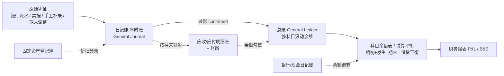

# PRD · 账簿模块 v1.0（EasybookX · 香港法定账簿体系）

> 适用：EasybookX Part A · 会计做账（香港中小企业 / 会计师事务所）
> 准则与法规：《公司条例》Cap.622 S.373、《税务条例》IRO Cap.112 S.51C、SME-FRS / HKFRS、复式记账、权责发生制、币种 HKD
> 关联：[[财务报告生成规则与说明]]、[[EasybookX_产品需求文档_PRD_v1.0]]、[[prompts_银行票据匹配会计分录]]

---

## 0. 修订记录
| 版本 | 日期 | 说明 |
|---|---|---|
| v1.0 | 2026-06-23 | 首版：账簿体系 HK 合规分析 + 现状差距 + 各账簿设计 + 路线图。原「账簿浏览」聚合页废弃，拆为标准账簿模块 |

---

## 1. 背景与合规依据

### 1.1 为什么需要规范账簿
账簿（Books of Account）是会计核算的载体，也是香港**法定要求**：
- **《公司条例》Cap.622 S.373**：公司须备存会计记录，做到 (a) 显示并解释公司交易；(b) 合理准确披露公司财务状况；(c) 使董事能据以编制**符合条例的财务报表**。会计记录须**保存 ≥ 7 年**（S.373(6)）。
- **《税务条例》IRO Cap.112 S.51C**：经营业务者须以中文或英文备存**足够的业务记录**（含载明收支/进支的账簿、凭证、银行月结单等），保存 ≥ 7 年。
- **SME-FRS / HKFRS**：以**复式记账（有借必有贷、借贷必相等）**与**权责发生制**为基础。

### 1.2 完整账簿体系（复式记账三层结构）
香港实务下，一套完整账簿分三层，**逐层勾稽**：

| 层 | 账簿 | 作用 |
|---|---|---|
| **① 序时账（原始记录）** | 普通日记账 General Journal、现金日记账 Cash Book、银行日记账 Bank Book、（特种：销售/采购日记账）| 按**时间顺序**登记每一笔分录 |
| **② 分类账（按科目）** | 总分类账 General Ledger（总账）、明细分类账 Subsidiary Ledger（应收/应付/固定资产/存货）| 按**科目**归集，得出各科目余额 |
| **③ 汇总/报表** | 科目余额表 / 试算平衡表 Trial Balance | 汇总全部科目期初/发生/期末，校验借贷平衡，编制财报 |

> 勾稽主线：**序时日记账 → 过账总账 → 汇总科目余额表 → 试算平衡 → 财务报表**。

---

## 2. 现状与差距分析（是否符合香港会计需求）

### 2.1 现状（本期已实现）
| 账簿 | 状态 | 说明 |
|---|---|---|
| 日记账（序时账）General Journal | ✅ 已实现 | 全部分录按日期/凭证序时，借/贷科目 + 金额 + 状态 |
| 总账 General Ledger | ✅ 已实现 | 按科目逐笔 + 滚动余额（期初→本期→期末，借/贷方向）|
| 科目余额表 Trial Balance | ✅ 已实现 | 期初 + 本期借贷发生 = 期末，按类别借/贷，借贷平衡校验 |
| 试算平衡表（独立页） | ✅ 已有 | 关账门槛 |

### 2.2 差距（HK 合规仍缺，建议补强）
| 缺口 | 严重度 | 风险 / 影响 | 建议 |
|---|---|---|---|
| **往来明细账 + 账龄（AR/AP）** | 🔴 高 | 仅有总账汇总，无法按**客户/供应商**看明细与账龄；应收坏账、应付逾期无法管控；审计必查 | 增「应收/应付明细账」按往来对象 + 账龄(30/60/90/90+) |
| **银行存款日记账 + 银行调节** | 🔴 高 | 银行流水页是采集，非正式**银行日记账**；缺账面银行 ↔ 对账单余额调节，无法保证完整性 | 增「银行/现金日记账」（序时+余额）+ 银行余额调节表 |
| **固定资产登记簿** | 🟠 中 | 折旧靠期末调整人工，缺资产台账（原值/累计折旧/净值/折旧方法/税务免税额）| 增固定资产登记簿，自动按月计折旧 |
| **特种日记账（销售/采购）** | 🟡 低 | 交易量大时序时账冗长 | 可选：按销售/采购分册 |
| **现金日记账（备用金）** | 🟠 中 | 现金提取→现金费用结转闭环缺台账 | 现金日记账串联备用金池 |

> 结论：当前「日记账 + 总账 + 科目余额表」构成了**最小可用的合规核心**（序时+分类+汇总三层齐备），**满足出具试算平衡与财报的基本勾稽**；但要完全贴合香港审计与税务实务，**应补 AR/AP 明细账（账龄）与银行日记账（调节）**，这是审计师与税局最关注、也是当前最大缺口。

---

## 3. 各账簿详细设计

### 3.1 日记账（序时账 General Journal）✅
- **定义**：按交易发生时间顺序登记的全部会计分录（原始记账簿）。
- **字段**：日期、凭证号(JV)、摘要、借方科目(Dr)、贷方科目(Cr)、金额、状态、来源（银行票据/手工补录/期末调整/期初）。
- **规则**：每笔借贷必相等；含已确认与待确认（待确认不计入报表）；按日期+凭证号排序。
- **筛选**：全部 / 已确认 / 待确认；账期；来源。
- **数据来源**：JournalEntry（全部）。**钻取**：凭证号 → 原始凭证（票据/流水）。

### 3.2 总账（General Ledger）✅
- **定义**：按科目归集的三栏式分类账（借/贷/余额）。
- **字段**：（选定科目）期初余额 B/F、逐笔（日期/凭证/摘要/借/贷/滚动余额）、本期合计、期末余额。
- **规则**：余额按科目**正常余额方向**（资产/费用 Dr；负债/权益/收入 Cr）滚动；仅已确认分录。
- **数据来源**：JournalEntry 已确认行，按 account 归集 + COA（代码/中文/类别/正常余额）。

### 3.3 科目余额表（Trial Balance）✅
- **定义**：全部科目的期初/本期借贷发生/期末余额汇总。
- **字段**：代码、科目名称(中英)、类别(A/L/E/I/X)、期初、本期借方、本期贷方、期末（借/贷）。
- **规则**：期末 = 期初 + 本期借 − 本期贷（按正常余额方向）；**借方合计 = 贷方合计**（平衡校验）。
- **数据来源**：总账聚合。**衔接**：试算平衡 → P&L / B&S（见 [[财务报告生成规则与说明]]）。

### 3.4 应收 / 应付明细账（AR / AP Subsidiary Ledger）🔶 建议
- **定义**：按**客户 / 供应商**逐户登记往来明细与余额。
- **字段**：往来对象、发票号、日期、应收/应付金额、已收/已付、未结余额、**账龄区间**（≤30 / 31–60 / 61–90 / 90+ 天）。
- **规则**：与总账「应收账款 / 应付账款」科目**余额勾稽一致**；账龄按发票日计算。
- **价值**：坏账评估、催收、应付到期管理；**审计与利得税必查**。
- **数据来源**：销售发票 / 采购票据 + 收付款（银行/现金）核销。

### 3.5 现金 / 银行日记账（Cash / Bank Book）🔶 建议
- **定义**：按账户逐笔登记现金/银行收支与**滚动余额**（序时账）。
- **字段**：日期、摘要、对方、收入、支出、余额；银行账号、账户类型。
- **关键**：**银行余额调节**——账面银行日记账期末余额 ↔ 银行对账单期末余额，差异列「在途/未达」调节，保证流水完整（见 [[财务报告生成规则与说明]] §5 校验关卡）。
- **数据来源**：银行流水（已确认）/ 现金（备用金）补录。

### 3.6 固定资产登记簿（Fixed Asset Register）🔶 建议
- **字段**：资产编号、名称、购入日期、原值、折旧方法、年限/残值、**累计折旧**、账面净值、本期折旧、**税务免税额（首年 60% + 其后每年 30% 递减结余）**。
- **规则**：账面折旧（会计）与税务免税额**分列**；按月自动计提折旧 → 生成期末调整分录。
- **价值**：折旧准确、利得税计算依据。

---

## 4. 数据来源与勾稽关系

- **核心勾稽**：日记账合计 = 总账过账合计；总账各科目期末 = 科目余额表对应行；AR/AP 明细合计 = 总账应收/应付科目余额；银行日记账余额 = 银行对账单余额（经调节）。

---

## 5. 通用功能与合规要求
- **筛选**：账期 / 科目 / 日期范围 / 状态 / 往来对象。
- **钻取（drill-down）**：账簿 → 凭证 → 原始单据（票据/流水），全链可追溯。
- **导出**：Excel / PDF（中英双语标题）。
- **关账锁定**：已关账期账簿**只读快照**，修改须反结账（见 [[财务报告生成规则与说明]] §四）。
- **留存**：≥ 7 年、不可篡改（append-only 审计留痕）。
- **多币种**：外币按交易日汇率折算 HKD 入账，账簿并列原币与本位币。
- **仅 confirmed 入账**：待确认分录在日记账可见但不计入总账/科目余额/报表。

## 6. 状态与权限
| 维度 | 取值 | 说明 |
|---|---|---|
| 分录状态 | pending / confirmed / ignored / reversed | 仅 confirmed 计入分类账与报表 |
| 账期 | open / locked | 关账后账簿只读 |
| 权限 | 记账员（录入）/ 主管·审核员（确认、关账）/ 查询员（只读导出）| 按 RBAC |

## 7. 实施路线图
| 阶段 | 账簿 | 状态 |
|---|---|---|
| **P0（已实现）** | 日记账（序时账）、总账、科目余额表 | ✅ 本期上线（账簿管理菜单）|
| **P1（建议优先）** | 应收/应付明细账 + 账龄、银行/现金日记账 + 银行调节 | 🔶 待开发 |
| **P2** | 固定资产登记簿（自动折旧）、特种日记账（销售/采购）| 🔶 规划 |

> 本期已将「账簿浏览」聚合页废弃，改为标准账簿模块（日记账 / 总账 / 科目余额表）置于「账簿管理」一级菜单下；AI 审计报告独立为一级栏目。P1 的 AR/AP 明细账与银行调节是贴合香港审计/税务的**下一步重点**。
