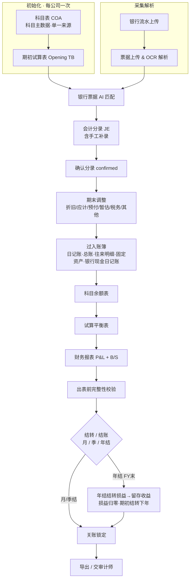
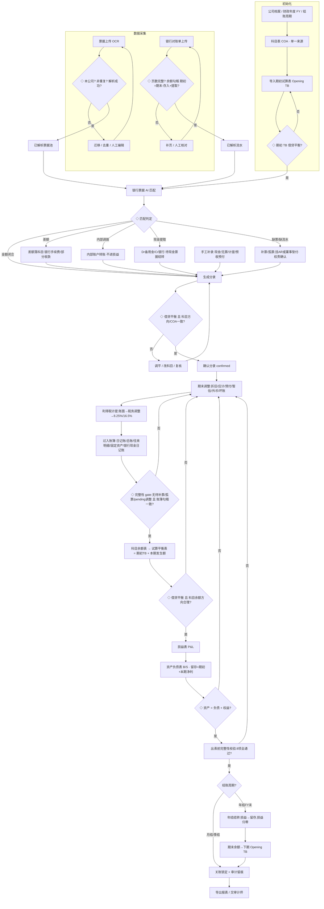

# 财务报告生成规则与说明（EasybookX）

> 适用：EasybookX Part A · 会计做账（香港中小企业 SME）
> 准则：SME-FRS / HKFRS · 复式记账 (Double-entry) · 权责发生制 (Accrual basis) · 币种 HKD
> 法理：《公司条例》Cap.622 S.373（须备妥会计纪录）、S.379（须备财务报表）、S.359（小型私人公司报告豁免可用 SME-FRS）；《税务条例》Cap.112 IRO S.51C（业务纪录须保存 **7 年**）
> 关联：[[PRD_账簿_v1.0]]、[[prompts_银行票据匹配会计分录]]、[[prompts_审计报告]]、[[PRD_审计报告_v1.0]]
> 数据对齐：科目表 COA 字段 `c(code)/en/zh/l(level)/p(parent)/cat(A/L/E/I/X)/nb(Dr|Cr)/post`；分录 `lines:[{type:Dr|Cr, account, amount}]`；接口 `/api/trial-balance`、`/api/reports/pl`、`/api/reports/bs`、`/api/period-close`。

本文件定义 EasybookX **从数据导入到财务报表**的全链路规则。核心主线：

> **初始化（科目表 + 期初余额）→ 采集解析（银行流水 / 票据）→ AI 匹配 → 会计分录（确认）→ 期末调整 → 过入账簿（日记账 / 总账 / 明细账 / 科目余额表）→ 试算平衡 → 结转 / 结账（年结）→ 财务报表 → 出表前完整性校验 → 关账锁定 / 导出**

EasybookX 产出的是**账簿与管理报表（management accounts）**；对外的**法定财务报表须经 HKICPA 执业会计师审计**，本平台不替代法定审计（定位为审前分析 / 审计辅助）。

---

## 0. 总览：模块流程与合规基线

### 0.1 端到端流程图（最新系统）



### 0.2 模块 ↔ 左侧菜单 ↔ 本文件章节

| 左侧菜单（账套内） | 作用 | 对应章节 |
|---|---|---|
| 银行流水上传 / 票据上传 & 解析 | 数据采集与 OCR 解析 | §六-流程 |
| 银行票据会计分录 | AI 匹配生成借贷分录 | [[prompts_银行票据匹配会计分录]] |
| 手工补录会计分录 | 现金 / 无票 / 计提等手工分录 | §三 |
| 期末调整 | 折旧 / 应计 / 预付 / 暂估 / 税务 / 其他 | §三 |
| 账簿管理（日记账 / 总账 / 科目余额表 / 往来明细账 / 银行现金日记账 / 固定资产登记簿）| 法定账簿与查询 | §二、[[PRD_账簿_v1.0]] |
| 试算平衡表 | 借贷平衡校验 | §四 |
| 结转分录（已合并「结账（年结结转）」）| 月 / 季 / 年结、损益结转、关账锁定 | §五 |
| 财务报表 | P&L / B/S（+出表前完整性校验）| §六 |
| 科目表 | 科目主数据维护（单一来源）| §一-1.4 |

### 0.3 香港合规基线（贯穿全流程）

| 要点 | 规则 |
|---|---|
| 法定会计纪录 | Cap.622 S.373：须备纪录以**显示与解释交易**、随时**合理准确反映财务状况**、并使**损益表与资产负债表得以编制**。 |
| 法定账簿体系 | 序时账（日记账）+ 分类账（总账）+ 明细账（往来 / 固定资产）；详见 §二。 |
| 纪录保存年限 | 公司纪录 7 年（S.373(6)）；业务纪录 7 年（IRO S.51C）。 |
| 会计准则 | 符合报告豁免的小型私人公司可采 **SME-FRS**（简化披露）；否则 HKFRS / HKFRS for Private Entities。 |
| 利得税 | 两级制：法团首 **HKD 200 万**应评税利润 **8.25%**，其后 **16.5%**；账面利润 ≠ 应评税利润（须税务调整）。香港不设 GST / VAT。 |
| 财政年度 | 可自定义；首年建账最长 18 个月；**年结按公司 FY 末触发，非自然年**。 |
| 审计 | 法定财务报表须经执业会计师审计；EasybookX 出具账目 / 管理报表，不替代法定审计。 |

---

## 一、通用基础

### 1.1 科目分类与正常余额方向

| 类别 cat | 含义 | 正常余额 nb | 增加方向 | 进入报表 |
|---|---|---|---|---|
| **A** Assets 资产 | 现金 / 银行 / 应收 / 存货 / 固定资产 | Dr 借 | 借增贷减 | 资产负债表 |
| **L** Liabilities 负债 | 应付 / 应计 / 税项 / 董事往来 | Cr 贷 | 贷增借减 | 资产负债表 |
| **E** Equity 权益 | 股本 / 留存收益 | Cr 贷 | 贷增借减 | 资产负债表 |
| **I** Income 收入 | 营业收入 / 利息收入 | Cr 贷 | 贷增借减 | 损益表 |
| **X** Expense 费用 | 各项费用 / 税项费用 | Dr 借 | 借增贷减 | 损益表 |

### 1.2 核心恒等式
- 复式：每条分录 **借方合计 = 贷方合计**。
- 试算平衡：**Σ 全部科目借方 = Σ 全部科目贷方**。
- 会计恒等式：**资产 = 负债 + 权益**（权益含本期损益）。
- 留存收益滚存：**期末留存 = 期初留存 + 本期净利 − 已派股息**。

### 1.3 仅「已确认」分录入账
- 分录状态：`pending`（草稿 / 待确认）→ `confirmed`（已确认）。
- **只有 `status=confirmed` 的分录与期末调整才过入账簿、进入试算平衡与财务报表**（与 `/api/trial-balance`：`JournalEntry.status=='confirmed'` + `AdjEntry.status=='confirmed'` 一致）。
- 关账后账期锁定（period locked），不可再改已确认分录，须走反结账 / 调整分录，保证审计可追溯。

### 1.4 科目表（COA）= 科目主数据单一来源 ★

> 这是本次系统的关键原则：**所有账簿与报表的科目代码 / 名称 / 类别 / 正常余额方向，唯一来源于科目表（COA）**。

- **单一来源**：科目的代码 `c`、中英文名、类别 `cat(A/L/E/I/X)`、正常余额 `nb`、是否可记账 `post`，**只在「科目表」维护**；账簿（日记账 / 总账 / 科目余额表 / 明细账）与报表（试算 / P&L / B/S）**只读引用**，不得另立科目代码。
- **记账只到末级可记账科目**（`post=true`）；L1 汇总科目仅用于报表归集，**禁止直接记账**（拦截）。
- **代码一致性**：分录所用科目须能在 COA 命中；账簿与报表展示的代码必须与 COA 完全一致（例：营业额 `4005`、利息收入 `4101`、电话及网络 `6235`、汽车费用 `6219`、差旅费 `6234`、银行手续费 `6204`、核数费 `6299`、工资 `6226`、强积金供款 `6217`、租金及差饷 `6223`、折旧及摊销 `6236`、利得税 `6501`；银行 `1002-01`、应收 `1122`、预付 `1123`、应付 `2202`、应付利得税 `2221`、股本 `3001`、留存收益 `3101`）。
- **校验**：科目名重复 / 代码缺失 / 报表代码与 COA 不符 → 出表前完整性校验告警（属「科目主数据一致性」）。

---

## 二、账簿体系（法定账簿）

> 已确认分录并非直接生成报表，而是先**过入账簿**，再由账簿汇总出试算平衡、进而出报表。账簿是 Cap.622 S.373 要求的法定会计纪录载体。详细设计见 [[PRD_账簿_v1.0]]。

### 2.1 账簿层级与系统对应

| 法定账簿层级 | 含义 | EasybookX 模块 | 主键 / 排序 |
|---|---|---|---|
| **序时账簿** Books of original entry | 按交易**时间顺序**逐笔登记 | 日记账（序时账）；银行日记账 / 现金日记账 | 日期 + 凭证号 |
| **分类账簿** General Ledger | 按**科目**归集，得各科目发生与余额 | 总账 | 科目代码 |
| **明细分类账** Subsidiary Ledgers | 往来对象 / 单项资产的**明细** | 往来明细账（AR / AP）、固定资产登记簿 | 客户 / 供应商 / 资产 |
| **科目汇总** | 各科目期初 + 借贷发生 + 期末 | 科目余额表 | 科目代码 |

### 2.2 过账与勾稽规则
- **过账**：每条已确认分录的 `lines` 按 `type(Dr/Cr)` 与 `account` 过入对应**总账科目**；同一分录按时间进入**日记账**；往来类科目（应收 / 应付 / 董事往来）同步进**往来明细账**；固定资产相关进**固定资产登记簿**；银行 / 现金类进**银行 / 现金日记账**。
- **勾稽必须成立**：
  - 日记账借贷合计 = 总账借贷合计 = 科目余额表借贷合计；
  - 某科目「总账期末余额」=「科目余额表期末余额」；
  - 往来明细账各对象余额合计 = 总账对应往来科目余额；
  - 固定资产登记簿净值合计 = 总账「固定资产 − 累计折旧」；
  - 银行日记账期末余额 ↔ 银行存款余额调节后的对账单余额。
- **科目维度统一**：账簿一律以 COA 代码 / 名称展示（§1.4）。
- **账期范围**：账簿按账套（公司）隔离，须先选定具体企业方可查看（多租户独立账套）。

### 2.3 由账簿到试算
> 科目余额表对每个科目计算 **期初余额 + 本期借方 + 本期贷方 = 期末余额**；将各科目期末（按正常余额方向归 Dr/Cr）汇总即为**试算平衡表**（§四）。

---

## 三、期末调整 (Period-End Adjustments)

### 3.1 定义与目的
将「收付实现」的流水账，按**权责发生制**调整为反映真实经营成果的账：把不属于本期的剔除、属于本期但未入账的补提。对齐 `AdjEntry`（`cat / dr_acct / cr_acct / amt / desc / status / period`）。

### 3.2 生成规则（六大类）

| 类别 cat | 场景 | 分录模板 | 香港要点 |
|---|---|---|---|
| **dep 折旧** | 固定资产按期计提折旧 | Dr 折旧及摊销(6236) / Cr 累计折旧(1660) | 税务用「免税额」（机械设备首年 60% + 其后每年 30% 递减结余制），账面折旧与税务免税额**分开**处理 |
| **accrued 应计** | 已发生未付（审计费 / MPF / 水电 / 利息） | Dr 相关费用 / Cr 应计 / 应付（核数费 2409、MPF 2244） | 审计费按年估列；MPF 雇主强制供款封顶 1,500 / 人 / 月 |
| **prepaid 预付** | 已付但跨期（保险 / 年租 / 年费） | Dr 预付款(1123) / Cr 费用；或付款先记预付、期末摊销 Dr 费用 / Cr 预付 | 按受益期间分摊 |
| **revenue 暂估** | 已供未开票 / 已收未供 | 应计收入：Dr 应收(1122) / Cr 收入；递延：Dr 收入 / Cr 递延收入 | 收入确认时点（HKFRS 15 / SME-FRS）|
| **tax 税务** | 利得税预提 | Dr 利得税费用(6501) / Cr 应付利得税(2221) | 两级 8.25% / 16.5%；账面利润经税务调整 → 应评税利润 |
| **other 其他** | 坏账 / 存货跌价 / 汇兑重估 | 坏账：Dr 坏账 / Cr 应收(或拨备)；汇兑：Dr/Cr 汇兑损益 | 期末外币货币性项目按收市汇率重估 |

### 3.3 操作规则
- 新增调整：选 `cat` → 借方科目、贷方科目、金额、说明，默认 `pending`；**单借单贷、金额相等**。
- 确认：逐条或「全部确认」→ `confirmed` 后过账并计入试算平衡；确认期末调整将**解除试算平衡表的前置提示**（链路解锁）。
- **AI 建议**：可由 AI 给出建议调整（折旧 / 应计 / 税务），复核后一键回填再确认。
- **顺序**：银行票据分录全部确认之后、试算平衡之前完成。
- **异常**：借贷不等→拦截；科目非 postable→提示更换；重复计提→去重提示。

---

## 四、试算平衡表 (Trial Balance, TB)

### 4.1 生成规则
- 由**科目余额表**汇总（= 全部已确认 JE + 已确认期末调整，按科目归集借贷）。
- 每个科目输出 `{ code, account, category(A/L/E/I/X), 期初, 本期借, 本期贷, 期末 }`，并合计 `dr_total / cr_total`。
- **平衡判定**：绝对值(dr_total − cr_total) < 0.01 → `balanced=true`；否则给出 `diff`。
- 可按账期 `period` 过滤；TB = **期初 TB 余额 + 本期已确认发生额**（非首年必须并入期初）。

### 4.2 操作规则
- 入口：`GET /api/trial-balance?period=YYYY-MM`；前置：当期分录与期末调整均已确认。
- **不平衡排查顺序**：① 借贷不等的分录；② 科目方向 / 类别设错；③ 漏确认 / 重复确认；④ 期初余额（Opening TB）是否结转。
- 平衡通过 → 解锁「确认试算表，生成结转分录」。
- **异常**：`balanced=false` 时**禁止出正式报表**。

### 4.3 示例（统一演示数据 · ABC Trading Co. Ltd · 月结演示）

```
科目代码  科目                                借方 Dr        贷方 Cr
1002-01   Bank — HSBC Current Account        38,500.00          —
1122      Trade receivables                  12,400.00          —
4005      Revenue from rendering of services       —      45,800.00
4101      Interest income                          —          18.50
6226      Wages and salaries                 18,000.00          —
6299      Audit fee (ADJ)                     5,000.00          —
6236      Depreciation and amortisation (ADJ)   400.00          —
2221      Profits tax payable (ADJ)                —       1,147.31
3101      Retained earnings (b/f)                  —     136,318.20
…（资产/负债/权益/收入/费用/税务全科目）
合计                                       214,209.01     214,209.01   →  借贷相等 ✓
```

> 全部科目代码与「科目表 / 账簿（科目余额表 / 总账）」完全一致（§1.4）。

---

## 五、结转分录 / 结账（Period Closing · 年结结转 Year-End Closing）

> 该模块已将原「结账（年结结转）」弹窗合并入左侧菜单【结转分录】，统一承担：**结账周期判定 + 损益结转 + 留存滚存 + 期初结转 + 关账锁定 / 反结账**。

### 5.1 两层含义
1. **期间关账锁定 (Period Lock)**：将账期由 `open` 置为 `locked`（审计日志 `SYSTEM_PERIOD_LOCKED`），已确认分录不可再改。
2. **结账结转分录 (Closing Entries)**：财政年度末把**临时科目（损益类）结转清零**，净利转入权益。

### 5.2 科目两分类（结账理论基础）

| 类别 | 科目 | 年末处理 |
|---|---|---|
| **永久科目（实账户）** | 资产 A / 负债 L / 权益 E | 余额**跨年延续**，结转为下年期初 |
| **临时科目（虚账户 / 损益类）** | 收入 I / 费用 X（含利得税费用） | 年末**结转清零**，不跨年累计 |

### 5.3 月结 / 季结 / 年结的区别（对应 `closing_frequency`）★

| 周期 | 是否结转损益 | 处理 |
|---|---|---|
| **月结 / 季结** | 否 | 仅**锁期 + 出管理报表**；损益类在本财政年度内**继续累计**，不清零（符合香港做账惯例）|
| **年结（FY 末）** | **是** | 执行 5.4 结转，损益归零、净利转留存、期末余额结转下年期初 TB |

> 关键纠正：损益类**不在每月清零**；月 / 季结只锁账出表，**年结才结转损益**。

### 5.4 年结结转分录（核心）
设损益汇总科目为 **本年利润 / P&L Summary**：
```
① 结转收入：  Dr 各收入科目 (I, 4005/4101…)   Cr 本年利润
② 结转费用：  Dr 本年利润                       Cr 各费用科目 (X, 6xxx)
③ 结转税款：  Dr 本年利润                       Cr 利得税费用 (6501)   ← 一并并入损益汇总
④ 结转净利：  Dr 本年利润 (= 税后净利)          Cr 留存收益 (3101, E)
            （若净亏损则方向相反：Dr 留存收益 / Cr 本年利润）
```
- 结转分录写入 JournalEntry，`source_type=closing`，`period=FY 末`。
- 结转后：**损益类科目 (I/X) 余额归零**；本年利润转入**留存收益**；本年利润余额 = 0。
- **留存收益变动表**：期末留存 = 期初留存 + 本期净利 − 已派股息（演示：136,318.20 + 12,759.49 − 0 = **149,077.69**，与 B/S 留存一致）。

### 5.5 期末余额结转下期（Opening TB Carry-Forward）
- 年结完成后，将**资产 / 负债 / 权益（含更新后的留存收益）期末余额**生成**下一 FY 的期初试算表**；损益类期初为 0。
- 形成「上期 Closing TB = 下期 Opening TB」的连续勾稽。

### 5.6 操作规则
1. **前置**：本期报表已生成、TB 平衡、B/S 平衡、无 pending 分录 / 调整。
2. **触发**：FY 末执行「年结」；月 / 季结仅锁期。
3. **生成结转分录**：系统按①②③④自动生成 `closing` 分录（借贷自平衡），供复核确认。
4. **关账锁定**：确认后账期 `locked`，写审计留痕；联动「出表前完整性校验」的「本期净利已结转留存收益」勾选。
5. **期初结转**：生成下期 Opening TB 预览。
6. **反结账 (Reopen)**：红冲结转分录、解锁账期，调整后重新结账（全程留痕）。

### 5.7 状态说明

| 维度 | 状态值 | 含义 / 判定 |
|---|---|---|
| 账期状态 | `open` / `locked` | 出表 + 锁定后 locked |
| 结账状态 | `not_closed` / `month_closed` / `year_closed` | 年结才做损益结转 |
| 结转分录 | `pending` / `confirmed` / `reversed` | source_type=closing |
| 期初结转 | `pending` / `carried` | 生成下期 Opening TB |

### 5.8 异常处理

| 异常 | 处理 |
|---|---|
| 报表未生成 / TB 不平衡 | 阻断结账，提示先平账出表 |
| 存在 pending 分录或调整 | 阻断，提示先确认 |
| 结转后损益类未归零 | 校验失败，回滚结转 |
| 留存收益滚存不符 | 提示核对（期初 + 净利 − 分红）|
| 已结账期再记账 | 阻断，提示先反结账 |
| 非首年缺上期 Closing TB | 提示补录期初 |

---

## 六、财务报表 (Financial Statements)

关账核心产出，依据试算平衡按科目类别汇总。对齐 `/api/reports/pl`、`/api/reports/bs`。

> **与结转的关系**：损益表按**本期**损益类（I/X）发生额列报（即结转前的本期数）；资产负债表的**留存收益 = 期初 + 本期净利**（即结转结果）。月 / 季结时损益不清零，报表照常按本期数出具。

### 6.1 损益表 P&L（Statement of Profit or Loss）
- **生成规则**（取 TB 中 `cat=I/X`）：
  - 收入 `revenue = Σ(I 类 cr − dr)`；费用 `expenses = Σ(X 类 dr − cr)`；净利 `net_profit = revenue − expenses`。
- **SME-FRS 列报**：营业额 Turnover → 销售成本 → 毛利 → 其他收入 → 行政 / 经营费用 → 财务费用 → 除税前溢利 → 利得税 → **本期净溢利 /(亏损)**。
- 演示：收入 45,818.50 − 经营费用 31,911.70 = 除税前溢利 13,906.80；利得税(8.25%)1,147.31；**税后净利 12,759.49**。

### 6.2 资产负债表 B/S（Statement of Financial Position）
- **生成规则**（取 TB 中 `cat=A/L/E`）：
  - 资产 `assets = Σ(A 类 dr − cr)`；负债 `liabilities = Σ(L 类 cr − dr)`；权益 `equity = Σ(E 类 cr − dr)`（本期净利并入留存收益）。
  - **平衡校验**：绝对值(assets − (liabilities + equity)) < 0.01。
- **SME-FRS 列报**：非流动资产 + 流动资产 = 总资产；流动 + 非流动负债 = 总负债；股本 + 留存收益 = 权益；**资产 = 负债 + 权益**。
- 演示：总资产 178,750.00 = 总负债 19,672.31 + 权益 159,077.69（股本 10,000 + 留存 149,077.69）✓。

### 6.3 现金流量表（简表，可选）
- 经营 / 投资 / 筹资三分类（SME-FRS 下小型私人公司可豁免，按需生成）。
- 由银行 / 现金类科目变动 + 损益推导，期末现金 = 期初现金 + 净变动。

### 6.4 出表前完整性校验（Pre-Report Checklist）★
报表页内置可收起的「出表前完整性校验」面板，正式出表前须逐项通过：

| 校验项 | 通过条件 |
|---|---|
| 期初余额已载入 (Opening TB) | 期初试算表已导入并平衡 |
| 银行存款余额调节 | 账面银行 = 对账单期末余额 |
| 完整性（待补票 / 孤票 / 待确认清零）| 三者计数为 0 |
| 试算平衡 (Dr = Cr) | 借贷合计相等 |
| 本期净利已结转留存收益 | 已结账（权益含本期损益）|
| 资产 = 负债 + 权益 | B/S 平衡 |
| 利得税计提（两级 8.25% / 16.5%）| 账面→税务调整后计提，并入期末调整 |
| 科目主数据一致性 | 报表 / 账簿代码与 COA 一致（§1.4）|

> 全部通过 → 「可正式出表」；否则报表标注为**草稿**。

### 6.5 操作规则与披露
- **顺序**：TB 平衡 → P&L → B/S（净利并入权益）→（可选）现金流量表 →（年结）结转 → 锁定。
- **一致性**：B/S 必须平衡；P&L 净利须与 B/S 留存收益变动一致。
- **关账**：报表确认后账期锁定，写 `SYSTEM_PERIOD_LOCKED`。
- **导出**：Excel / PDF；口径与币种统一 HKD。
- **香港披露**：Cap.622 S.359 报告豁免私人公司可采 SME-FRS 简化披露；利得税按两级税率；法定财务报表须经执业会计师审计后方可对外（平台仅出账目 / 管理报表）。

### 6.6 异常处理

| 异常 | 处理 |
|---|---|
| 试算未平衡仍要出表 | 阻断；提示先平账 |
| B/S 不平衡 | 检查净利结转、科目类别、期初余额 |
| 净利与权益不一致 | 核对损益结转分录 |
| 缺期初余额（非首年）| 提示补录 Opening TB |
| 存在 pending 调整 | 提示先确认全部期末调整 |
| 报表代码与 COA 不符 | 提示以科目表为准修正（§1.4）|

---

## 七、端到端流程与完整性校验（银行流水 / 票据 → 财务报表）

> 在关键节点标注**校验关卡（◇）**，缺一即可能导致报表错误（详见 §7.2）。



### 7.1 关键校验关卡（◇）

| 关卡 | 校验内容 | 缺失后果 |
|---|---|---|
| ◇G0 | 期初 TB 借贷平衡、非首年须有上期结转 | 资产负债表永不平衡 |
| ◇V2 | 银行对账单页数完整 + **银行存款余额调节** | 漏记交易，损益 / 资产不全 |
| ◇V3 | 差额落科目、内部调拨不进损益、现金提取建池待结转 | 损益虚增 / 虚减、科目错配 |
| ◇V4 | 借贷平衡 **且** 科目方向 / 分类正确、**代码命中 COA** | 错类、代码与账簿不符 |
| ◇V5 | 待补票 / 孤票 / pending 清零 **且 账簿勾稽一致** | 当期收支不完整、账证不符 |
| ◇V6 | 试算平衡 + 科目余额方向合理（资产不应贷余）| 异常未发现，报表失真 |
| ◇V7 | 资产 = 负债 + 权益 | B/S 不平衡，报表不可用 |

### 7.2 缺口与必备校验节点清单（按对报表影响排序）

| 严重度 | 节点 | 风险 / 影响 | 补强 |
|---|---|---|---|
| 🔴 高 | **报表纳入期初余额** | 报表须 = 期初 TB + 本期发生额；仅按本期分录推导则 B/S 必错 | TB / B/S 合并 Opening TB |
| 🔴 高 | **银行存款余额调节表** | 漏一笔即损益 / 资产错 | 账面银行 ↔ 对账单期末余额 |
| 🔴 高 | **本期净利结转留存收益** | 不结转则权益缺本期损益，B/S 不平衡 | 出 B/S 前并入「期初留存 + 本期净利」 |
| 🔴 高 | **权责发生制（AR/AP/预收预付）** | 按现金制确认则收入 / 费用错期、漏计 | 已开票未收→Dr AR/Cr 收入；已收未供→递延 |
| 🔴 高 | **科目主数据一致性（COA 单一来源）** | 报表 / 账簿代码与科目表不一致 → 账证报表对不上 | 代码统一引用 COA；出表前一致性校验（§1.4）|
| 🟠 中 | **利得税税务调整（两级制）** | 账面利润 ≠ 应评税利润 → 税额错 | 账面→税务调整→8.25% / 16.5% |
| 🟠 中 | **跨期截止 (cut-off)** | 票据 / 流水归属错期 | 按交易日归期，期末 cut-off 校验 |
| 🟠 中 | **外币折算与期末重估** | 漏算汇兑损益 | 交易日入账 + 期末收市汇率重估 |
| 🟠 中 | **现金 / 备用金结转闭环** | 提现仅 Dr 备用金、现金费用未结转 → 备用金虚高 | Dr 费用 / Cr 备用金 闭环 |
| 🟠 中 | **账簿勾稽（账证 / 账账 / 账表）** | 日记账 / 总账 / 明细账 / 科目余额表对不上 | 过账后自动勾稽校验（§2.2）|
| 🟡 低 | **必备期末调整清单** | 折旧 / 审计费 / MPF / 利息 / 坏账漏提 | 关账前强制 checklist |
| 🟡 低 | **科目余额方向合理性** | 借贷虽平但方向异常未发现 | 出表前异常扫描 |

---

## 附：关账出表速览


> 单一来源：**科目表(COA)** 为科目主数据唯一来源，账簿与报表只读引用、代码全程一致。
> 香港要点：法定账簿 7 年留存（Cap.622 / IRO S.51C）、SME-FRS 简化披露、利得税两级 8.25%/16.5%、年结按 FY 末、法定审计另行。
