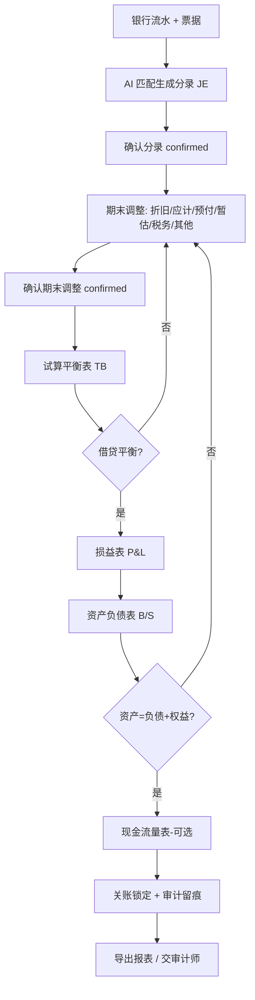

# 财务报告生成规则与说明（EasybookX）

> 适用：EasybookX Part A · 会计做账（香港中小企业）
> 准则：SME-FRS / HKFRS · 复式记账 · 权责发生制 (Accrual basis) · 币种 HKD
> 关联：[[prompts_银行票据匹配会计分录]]、[[prompts_审计报告]]、[[PRD_审计报告_v1.0]]
> 数据对齐：COA 分类 `A/L/E/I/X`；分录 `lines:[{type:Dr|Cr, account, amount}]`；
> 接口 `/api/trial-balance`、`/api/reports/pl`、`/api/reports/bs`。

本文件定义关账出表的三大环节规则：**一、期末调整** → **二、试算平衡表** → **三、财务报表**。
三者顺序执行、层层依赖：先把当期交易与期末调整全部「确认 (confirmed)」，再聚合为试算平衡，平衡后方可出具财务报表。

---

## 通用基础

### 科目分类与正常余额方向
| 类别 code | 含义 | 正常余额 | 增加方向 | 进入报表 |
|---|---|---|---|---|
| **A** Assets 资产 | 现金/银行/应收/存货/固定资产 | Dr 借 | 借增贷减 | 资产负债表 |
| **L** Liabilities 负债 | 应付/应计/税项/董事往来 | Cr 贷 | 贷增借减 | 资产负债表 |
| **E** Equity 权益 | 股本/留存收益 | Cr 贷 | 贷增借减 | 资产负债表 |
| **I** Income 收入 | 营业收入/利息收入 | Cr 贷 | 贷增借减 | 损益表 |
| **X** Expense 费用 | 各项费用/税项费用 | Dr 借 | 借增贷减 | 损益表 |

### 核心恒等式
- 复式：每条分录 **借方合计 = 贷方合计**。
- 试算平衡：**Σ 全部科目借方 = Σ 全部科目贷方**。
- 会计恒等式：**资产 = 负债 + 权益**（含本期损益）。

### 仅「已确认」分录入账
- 分录状态：`pending`（草稿/待确认）→ `confirmed`（已确认）。
- **只有 `status=confirmed` 的分录与期末调整才进入试算平衡与财务报表**（与 `/api/trial-balance` 实现一致：`JournalEntry.status=='confirmed'` + `AdjEntry.status=='confirmed'`）。
- 关账后该账期锁定（period locked），不可再改已确认分录，保证审计可追溯（Cap.622 / 账簿 7 年留存）。

---

## 一、期末调整 (Period-End Adjustments)

### 1.1 定义与目的
将「收付实现」的流水账，按**权责发生制**调整为反映真实经营成果的账：把不属于本期的剔除、属于本期但未入账的补提。对齐 EasybookX `AdjEntry`（字段 `cat / dr_acct / cr_acct / amt / desc / status / period`）。

### 1.2 生成规则（六大类）
| 类别 cat | 场景 | 分录模板 | 香港要点 |
|---|---|---|---|
| **dep 折旧** | 固定资产按月/期计提折旧 | Dr 折旧费用 / Cr 累计折旧 | 税务上用「免税额」(首年 60% + 其后每年 30% 递减结余制)，账面折旧与税务免税额分开 |
| **accrued 应计** | 已发生未付款的费用（审计费、MPF、水电、利息） | Dr 相关费用 / Cr 应计费用(Accruals) | 审计费按年估列分摊；MPF 雇主供款封顶 1,500/人/月 |
| **prepaid 预付** | 已付款但跨期的费用（保险、年租、年费） | Dr 预付费用(Prepayments) / Cr 费用（或付款时先记预付，期末摊销 Dr 费用/Cr 预付） | 按受益期间分摊 |
| **revenue 暂估** | 已提供服务未开票收入 / 已收款未提供服务 | 应计收入：Dr 应收/合同资产 / Cr 收入；递延收入：Dr 收入 / Cr 递延收入(Deferred income) | 收入确认时点（HKFRS 15 / SME-FRS）|
| **tax 税务** | 利得税预提（暂估当年应缴利得税） | Dr 利得税费用 / Cr 应交税项(Tax payable) | 两级税率：首 HKD 200 万应评税利润 **8.25%**，其后 **16.5%**；账面利润≠应评税利润（需税务调整） |
| **other 其他** | 坏账计提、存货跌价、汇兑重估等 | 坏账：Dr 坏账 / Cr 应收(或拨备)；汇兑：Dr/Cr 汇兑损益 / 外币货币性项目 | 期末外币货币性项目按收市汇率重估 |

### 1.3 操作规则与说明
- 新增调整：选择 `cat` → 填借方科目、贷方科目、金额、说明，状态默认 `pending`。
- **借贷一致校验**：调整为单借单贷，金额相等。
- **确认**：逐条「确认」或「全部确认」(`confirm-all`) → `confirmed` 后计入试算平衡。
- **AI 生成调整建议**：审计报告/关账流程可由 AI 给出建议调整分录（折旧/应计/税务），用户复核后一键「回填期末调整」再确认。
- **顺序**：期末调整应在「银行票据分录」全部确认之后、试算平衡之前完成。
- **异常**：借贷不等→拦截；科目非 postable→提示更换；重复计提→去重提示。

---

## 二、试算平衡表 (Trial Balance, TB)

### 2.1 生成规则
- 聚合**全部已确认**分录（JE + 已确认期末调整）的每一行，按科目汇总借方与贷方：
  - 对每条 line：`type=Dr` → 累加该科目借方；`type=Cr` → 累加贷方。
  - 期末调整：`dr_acct` 记借、`cr_acct` 记贷，各 1 行。
- 输出每个科目的 `{ account, code, category(A/L/E/I/X), dr, cr }`，并合计 `dr_total / cr_total`。
- **平衡判定**：`|dr_total − cr_total| < 0.01` → `balanced=true`；否则 `diff` 给出差额。
- 可按账期 `period` 过滤（按分录日期前缀匹配）。

### 2.2 操作规则与说明
- 入口：`GET /api/trial-balance?period=YYYY-MM`。
- 前置：当期「银行票据分录」与「期末调整」均已确认。
- **不平衡排查顺序**：① 是否有借贷不等的分录；② 科目方向/类别是否设错；③ 是否漏确认或重复确认；④ 期初余额(opening TB)是否结转。
- 平衡通过 → 解锁「确认试算平衡，生成财务报表」按钮。
- **异常**：`balanced=false` 时**禁止出正式报表**，需先修正分录/调整。

### 2.3 示例（结构）
```
科目                              借方 Dr      贷方 Cr
Bank — HSBC Current Account      54,820.00          —
Revenue from rendering of services    —      45,800.00
Telephone and internet              488.00          —
Depreciation and amortisation       400.00          —
Tax payable                            —       3,538.16
...
合计                            XXX,XXX.XX   XXX,XXX.XX   →  借贷相等 ✓
```

---

## 三、财务报表 (Financial Statements)

关账核心产出，依据试算平衡按科目类别汇总。对齐 `/api/reports/pl`、`/api/reports/bs`。

### 3.1 损益表 P&L（Statement of Profit or Loss）
- **生成规则**（取 TB 中 `category=I/X` 的科目）：
  - 收入 `revenue = Σ(I 类科目 cr − dr)`
  - 费用 `expenses = Σ(X 类科目 dr − cr)`
  - 净利 `net_profit = revenue − expenses`
- **SME-FRS 列报结构**：营业额 Turnover → 销售成本 Cost of sales → 毛利 Gross profit → 其他收入 → 行政/经营费用 → 财务费用 → 除税前溢利 → 利得税 → **本期净溢利/(亏损)**。

### 3.2 资产负债表 B/S（Statement of Financial Position）
- **生成规则**（取 TB 中 `category=A/L/E` 的科目）：
  - 资产 `assets = Σ(A 类 dr − cr)`
  - 负债 `liabilities = Σ(L 类 cr − dr)`
  - 权益 `equity = Σ(E 类 cr − dr)`（本期净利并入留存收益/权益）
  - **平衡校验**：`|assets − (liabilities + equity)| < 0.01`。
- **SME-FRS 列报结构**：非流动资产 + 流动资产 = 总资产；流动负债 + 非流动负债 = 总负债；股本 + 储备/留存收益 = 权益；**资产 = 负债 + 权益**。

### 3.3 现金流量表（简表，按科目推导）
- 经营活动 / 投资活动 / 筹资活动三分类（SME-FRS 下小型私人公司可豁免，按需生成）。
- 由银行/现金类科目变动 + 损益推导，期末现金 = 期初现金 + 净变动。

### 3.4 操作规则与说明
- **顺序**：试算平衡通过 → 生成 P&L → 生成 B/S（净利结转权益）→（可选）现金流量表。
- **一致性校验**：B/S 必须平衡；P&L 净利须与 B/S 权益中本期损益一致。
- **关账**：报表确认后该账期锁定，写审计日志 `SYSTEM_PERIOD_LOCKED`。
- **导出**：支持导出 Excel/PDF；报告口径与币种统一 HKD。
- **香港披露要点**：
  - 符合《公司条例》报告豁免 (Cap.622 S.359) 的私人公司可采用 SME-FRS 简化披露。
  - 利得税：账面除税前利润经**税务调整**（折旧→免税额、不可扣除开支等）得应评税利润，再按 8.25%/16.5% 两级税率计税。
  - 法定财务报表须由 HKICPA 执业会计师审计后方可对外（平台仅出具账目与管理报表，不替代法定审计）。

### 3.5 异常处理
| 异常 | 处理 |
|---|---|
| 试算未平衡仍要出表 | 阻断；提示先平账 |
| B/S 不平衡 | 检查净利结转、科目类别、期初余额 |
| 净利与权益不一致 | 核对损益结转分录 |
| 缺期初余额（非首年） | 提示补录 opening TB |
| 存在 pending 调整 | 提示先确认全部期末调整 |

---

## 附：关账出表完整流程


